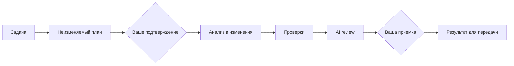

<p align="center">
  
</p>

# Flowcairn

**AI предлагает изменения. Вы видите план, управляете разрешениями и принимаете проверенный результат.**

Flowcairn — локальный Graph Runtime с интерфейсом на React Flow. Он превращает задачу в последовательность этапов: подтверждение плана → анализ → изменения в отдельном worktree → проверки → review → ваша приемка. Для каждой попытки остаются статус и доказательства результата.

[Установка в проект](docs/INSTALLATION.md) · [Первая задача](docs/FIRST-TASK.md) · [Как это устроено](docs/ARCHITECTURE.md) · [Ограничения](docs/LIMITATIONS.md) · [Что проверено](docs/VERIFICATION.md)

## Что вы получаете

- **Понятный процесс.** На графе видны текущий этап, зависимости, ошибки и следующее доступное действие.
- **Контроль изменений.** Вы задаете scope и разрешения. AI предлагает изменения; доверенный Executor проверяет и применяет их.
- **Проверяемый результат.** Diff, результаты checks и review связаны с конкретной попыткой. Завершение AI-вызова само по себе не означает успех.
- **Остановку при неопределенности.** Неизвестный результат не повторяется вслепую. Recovery и новая версия плана сохраняют историю.

Flowcairn полезен для ограниченных задач в существующем Git-проекте. Это ранний релиз: не универсальная автономная команда и не гарантия качества кода. Для маленькой правки весь цикл может быть избыточным.

## Начать

Нужны **Node.js 22, Git и Docker**. В проекте должен быть npm или pnpm и настроенные scripts для выбранных проверок. [Поддерживаемые режимы AI](docs/LIMITATIONS.md#платформы-и-провайдеры).

В каталоге своего проекта:

```bash
npm install --save-dev https://github.com/IgorBabikov/flowcairn/releases/download/v0.1.1/flowcairn-0.1.1.tgz
npx --no-install flowcairn init --provider codex --model MODEL
npx --no-install flowcairn doctor
npx --no-install flowcairn checks prepare
```

`MODEL` замените на точный ID доступной вам модели. Codex-режим требует macOS и Codex CLI `0.145.0`. Для OpenAI API используйте `--provider openai` и настройте собственный ключ локально, как описано в [руководстве](docs/INSTALLATION.md#выбрать-ai-провайдера).

Проверьте созданную `.flowcairn.json` и изменения установки. Сохраните их своим обычным Git-процессом: **до первой задачи рабочее дерево должно быть чистым**. `init` не меняет ваши `AGENTS.md` и hooks и не выполняет commit.

Зарегистрируйте небольшую задачу, создав ее план без запуска AI:

```bash
npx --no-install flowcairn task --id ORCH-001 --goal "Добавить проверку пустого ввода" --scope src --accept "Пустой ввод отклоняется; существующие сценарии проходят"
npx --no-install flowcairn ui
```

Откройте ссылку из терминала. Интерфейс работает на `127.0.0.1:4329`; ссылка содержит локальную сессию управления — не публикуйте ее. Изучите план, scope и разрешения перед подтверждением.

Пакет устанавливается из **GitHub Release**. Публикация в npm registry не заявляется. [Альтернатива: запуск из исходников](docs/INSTALLATION.md#запуск-из-исходников).

## Рабочий цикл



Commit, merge, push и deploy выполняются отдельно по вашим правилам. Кнопка приемки не публикует код.

## Как выглядит работа


Скриншот установленного пакета после реального Codex + Docker запуска. AI исправил один разрешенный файл, проверки и review прошли; результат принят. Подробности и границы проверки — [здесь](docs/VERIFICATION.md).

## Разобраться глубже

| Нужно | Открыть |
| --- | --- |
| Установить в свой репозиторий и выбрать провайдера | [Установка](docs/INSTALLATION.md) |
| Пройти задачу от постановки до передачи результата | [Первая задача](docs/FIRST-TASK.md) |
| Настроить context, checks и модель review | [Конфигурация](docs/CONFIGURATION.md) |
| Восстановиться после ошибки или неизвестного результата | [Диагностика](docs/TROUBLESHOOTING.md) |
| Понять границы доверия, storage и роли | [Архитектура](docs/ARCHITECTURE.md) |
| Оценить платформы, лимиты и зрелость | [Ограничения](docs/LIMITATIONS.md) |
| Предложить изменение или сообщить об ошибке | [Участие](CONTRIBUTING.md) · [Поддержка](SUPPORT.md) |

Нормативный документ: [Graph + ReactFlow Standard](docs/GRAPH-REACTFLOW-STANDARD.md). Это направление развития; наличие требования в стандарте не означает, что функция уже реализована.

**Лицензия:** [MIT](LICENSE). Зависимости и их лицензии: [THIRD_PARTY_NOTICES.md](THIRD_PARTY_NOTICES.md). Об уязвимости сообщайте [приватно](SECURITY.md).
