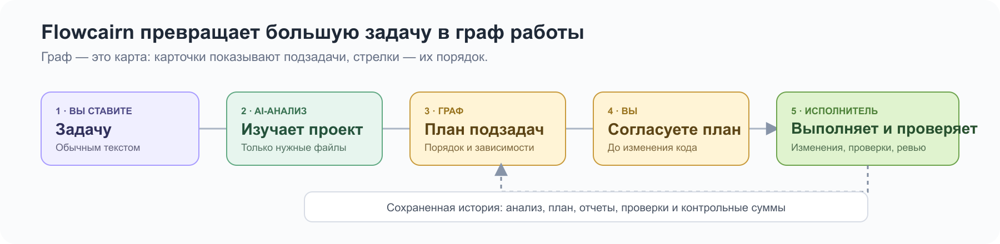
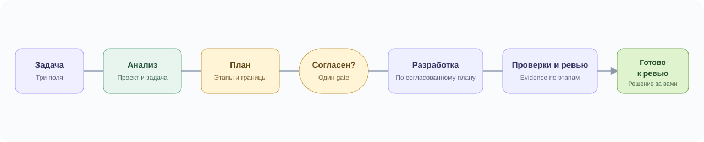

<p align="center">
  
</p>

<p align="center">
  <a href="#быстрый-старт"><strong>Установить</strong></a> ·
  <a href="#одна-большая-задача--понятный-план">Как помогает</a> ·
  <a href="#первая-задача">Первая задача</a> ·
  <a href="docs/README.md">Документация</a>
</p>

<p align="center">
  <a href="https://github.com/IgorBabikov/flowcairn/actions/workflows/ci.yml"></a>
  <a href="https://www.npmjs.com/package/flowcairn"></a>
  <a href="LICENSE"></a>
  <a href="https://github.com/IgorBabikov/flowcairn/releases"></a>
  <a href="docs/INSTALLATION.md"></a>
</p>

# AI-разработка, которой можно управлять

**Flowcairn берет одну большую задачу, анализирует проект и разбивает работу на понятные подзадачи.** Вы видите их порядок, соглашаетесь с планом и затем наблюдаете изменения, проверки, ревью и приемку.

Он устанавливается рядом с существующим проектом и показывает, что происходит, почему работа остановилась и чем подтвержден результат.

**Граф** — это карта работы: карточки показывают подзадачи, а стрелки — их порядок и зависимости. React Flow рисует эту карту. Локальный исполнитель управляет выполнением, разрешениями и сохраненным состоянием.

## Одна большая задача — понятный план

| Обычно с AI | С Flowcairn |
| --- | --- |
| Большая задача остается одним огромным запросом | Анализирует проект и разбивает задачу на подзадачи в правильном порядке |
| Требования растворяются в длинной переписке | До изменений есть короткий план с этапами и зависимостями |
| Непонятно, на чем остановилась большая задача | Видны текущий этап графа, зависимости, причина остановки и доказательства выполнения |
| Проверки и ревью остаются последним сообщением в чате | Проверки, ревью и приемка — обязательные этапы графа |
| Сложно безопасно продолжить после ошибки | Исполнитель предлагает только разрешенные действия: повтор, восстановление или новый план |

**Первый полезный момент:** до изменения кода вы видите подзадачи и соглашаетесь с планом. После работы получаете не обещание AI, а список изменений, проверки и доказательства результата.

## Не черный ящик: что происходит внутри



### 1. Граф — исполняемая карта задачи

У каждого этапа есть результат, зависимости, разрешенные действия, критерий успеха и доказательства. Граф нужен, чтобы большая задача не превращалась в набор сообщений без порядка и ответственности.

### 2. AI предлагает, Flowcairn проверяет

AI может предложить анализ, план, изменение или ревью. Исполнитель проверяет план, файлы, действия, разрешения и зависимости. React Flow не принимает эти решения — он показывает состояние системы.

### 3. Память — это проверяемые факты

Локально сохраняются версия плана, анализ, отчеты, артефакты, контрольные суммы, проверки и ревью. При уточнении плана Flowcairn использует сохраненный анализ. Если код, правила или контекст изменились, прежний план останавливается как устаревший и не продолжается вслепую.

### 4. AI-узлы имеют одну задачу

Это не бесконтрольная толпа подагентов. В обычной работе есть отдельные AI-этапы: анализ, планирование, реализация и ревью. Каждый получает только контекст своего этапа и возвращает структурированный результат.

### 5. Человек остается владельцем результата

До записи есть согласование плана. После работы остаются список изменений, проверки, ревью и личная приемка. Создание commit, отправка в репозиторий, deploy и финальное решение Flowcairn не выполняет автоматически.

[Открыть полное объяснение устройства Flowcairn →](docs/HOW-FLOWCAIRN-WORKS.md)

## Посмотрите, как это работает


Во время выполнения этап подсвечивается, активная связь показывает переход. На снимке — FORM-102: форма регистрации с email, паролем, названием компании и ИНН; первые этапы завершены, реализация активна. Это тот же сценарий, который разобран в разделе «Первая задача». Цвет дополняется текстом; уменьшенное движение поддерживается. [Что проверено](docs/VERIFICATION.md).

| Вам нужно | Flowcairn показывает |
| --- | --- |
| Понять план до изменения кода | Этапы, зависимости и границы задачи |
| Контролировать работу AI | Текущий этап, остановку, ошибку и безопасные варианты продолжения |
| Проверить результат | Измененные файлы, diff, проверки и отдельное ревью |
| Передать результат человеку | Готовый маршрут личного ревью с фактами по каждому этапу |

## Быстрый старт

**Нужны:** Node.js 22, существующий проект и доступ к AI. Для проверок нужен Docker. Подтвержденные менеджеры: npm, pnpm и Yarn 4 с `node_modules`. [Платформы и ограничения](docs/INSTALLATION.md).

В терминале **своего проекта**:

```bash
npm install -D flowcairn@latest
npx flowcairn
```

1. **Установка** добавляет готовый пакет с интерфейсом. Собирать React Flow самому не нужно.
2. **Первый запуск** предложит короткую настройку и откроет UI.
3. **Дальше** заполните три поля задачи — никаких JSON-файлов.

Пакет: [flowcairn в npm](https://www.npmjs.com/package/flowcairn).

<details>
<summary><strong>Установка через pnpm</strong></summary>

```bash
pnpm add -D flowcairn@latest
pnpm exec flowcairn
```

В pnpm workspace из корня используйте `pnpm add -Dw flowcairn@latest`. Команда `pnpm install flowcairn` устанавливает зависимости проекта, а не добавляет Flowcairn.

</details>

<details>
<summary><strong>Модель, Docker, Linux, Yarn и другие способы</strong></summary>

На macOS по умолчанию используется Codex, на Linux — OpenAI API. Нужен ваш доступ к поддерживаемому провайдеру; ключ не вводится в поле ID модели.

Для выполнения настроенных проверок подготовьте окружение:

```bash
npx flowcairn checks prepare
```

Команда может загрузить Docker-образ и зависимости. Она не запускает AI.

Нативный Windows и Bun пока не поддерживаются. Для WSL2 есть проверки среды, но полный запуск на реальном Windows-хосте еще не подтвержден.

[Все способы установки и настройка AI →](docs/INSTALLATION.md)

</details>

## Первая задача

В интерфейсе всего три поля: **заголовок, описание и номер задачи**. Например:

> Добавь форму регистрации с email, паролем и подтверждением пароля. Для компании показывай название и ИНН. Объясняй ошибки рядом с полями, сохраняй введенные данные и блокируй повторную отправку.

1. Нажмите **«Запустить»**. Первый этап анализирует проект и задачу.
2. Второй этап составляет план и показывает его справа. Напишите уточнение, если что-то нужно изменить — анализ и контекст сохранятся.
3. Нажмите **«Согласен»**. Дальше идут реализация, проверки, ревью и разрешенные исправления.
4. Дождитесь **«Готово к личному ревью»**, проверьте изменения и сами подготовьте commit и PR.

Повторных штатных согласований после плана нет. Неизвестный результат, выход за разрешенные границы или исчерпанный лимит остановят работу с объяснением.

[Пройти весь сценарий с объяснениями →](docs/FIRST-TASK.md)



## Если что-то пошло не так

**Ошибка** означает известный неуспех. **Неопределенность** означает, что результат или остановка не доказаны. Flowcairn не смешивает эти состояния и не предлагает небезопасный повтор. После изменения плана или правил требуется новая версия и подтверждение.

```bash
npx flowcairn doctor
```

[Ошибки и восстановление →](docs/TROUBLESHOOTING.md) · [Ограничения →](docs/LIMITATIONS.md)

## Вопросы, которые обычно возникают

<details>
<summary><strong>Зачем нужен граф, если можно написать задачу в чат?</strong></summary>

Чат хорошо помогает с одним изменением. В сложной задаче нужно видеть подзадачи, зависимости, границы, проверки и причину остановки. Граф делает каждый этап отдельным проверяемым контрактом и сохраняет связь между задачей, планом, изменениями и результатом.

</details>

<details>
<summary><strong>Какие инструкции использует Flowcairn?</strong></summary>

В пакет уже входят инструкции для анализа проекта, планирования, реализации, тестирования, безопасности, документации, отладки и ревью. По распознанному стеку добавляется подходящая инженерная, frontend-, backend- или mobile-инструкция. Их имена и контрольные суммы фиксируются в плане и отчете, а исходный текст открыт в [папке инструкций](skills) и [документации качества](docs/SKILLS.md).

</details>

<details>
<summary><strong>Есть ли внутри агенты и подагенты?</strong></summary>

Flowcairn не запускает свободную сеть агентов. Он вызывает изолированные AI-этапы с одной ролью: анализ, планирование, реализация или ревью. Каждый этап получает ограниченный контекст и не может сам расширить свои разрешения.

</details>

<details>
<summary><strong>Зачем нужны Executor и Orchestrator?</strong></summary>

Исполнитель (Executor) ведет обычный граф: определяет готовый этап, проверяет зависимости и разрешения, запускает действие, сохраняет отчет и пересчитывает дальнейшие этапы. Оркестратор (Orchestrator) нужен для отдельного крупного процесса интеграции: рабочая копия, проверка кандидата и контролируемое объединение изменений. React Flow остается интерфейсом к этим правилам.

</details>

<details>
<summary><strong>Что Flowcairn помнит между этапами?</strong></summary>

Он хранит локальные факты: задачу, версии плана, анализ, артефакты, отчеты, результаты проверок, ревью и контрольные суммы. Это не общая память чата. Система возвращает только нужные проверенные артефакты следующему этапу, а при изменении исходных данных помечает старый план как устаревший. Это уменьшает риск потерять согласованные факты, но не гарантирует отсутствие ошибок AI: результат все равно проходит проверки, ревью и личную приемку.

</details>

<details>
<summary><strong>Экономит ли Flowcairn токены?</strong></summary>

Он снижает лишний контекст: AI получает только разрешенные файлы конкретного этапа, а уточнение плана использует сохраненный анализ. Но текущая версия не сохраняет фактический расход токенов от провайдера, поэтому не обещает фиксированную экономию или процент. Для небольшой задачи несколько отдельных этапов могут стоить дороже одного чата. Следующая честная ступень — отчеты о расходе: входящие, исходящие и закешированные токены там, где провайдер их сообщает.

</details>

<details>
<summary><strong>Насколько система безопасна?</strong></summary>

Неизвестные действия и разрешения блокируются. Задача не может передать произвольную shell-команду, запись ограничена утвержденными путями, проверки идут через зарегистрированные Docker-команды, а опасный или недоказанный результат останавливает запуск. Flowcairn не заменяет проверку списка изменений человеком и не отменяет правила вашей организации или AI-провайдера. Полные границы описаны в [SECURITY.md](SECURITY.md) и [ограничениях](docs/LIMITATIONS.md).

</details>

<details>
<summary><strong>Как отключить Flowcairn</strong></summary>

Закройте UI, завершите активные операции и выполните:

```bash
npx flowcairn uninstall
```

Удаляются только неизмененные файлы установки и управляемые инструкции. Результаты, история и рабочие копии сохраняются; команда перечислит остатки. Зависимость пакета удаляется отдельно менеджером пакетов, например `npm uninstall flowcairn`.

</details>

## Документация и участие

| Начать работу | Разобраться глубже |
| --- | --- |
| [Установка и провайдеры](docs/INSTALLATION.md) | [Архитектура](docs/ARCHITECTURE.md) |
| [Первая задача](docs/FIRST-TASK.md) | [Стандарт Graph + React Flow](docs/GRAPH-REACTFLOW-STANDARD.md) |
| [Как работает Flowcairn](docs/HOW-FLOWCAIRN-WORKS.md) | [Проверки и их границы](docs/VERIFICATION.md) |
| [Workflow Contract](docs/FLOWCAIRN-WORKFLOW.md) | [Ограничения](docs/LIMITATIONS.md) |
| [Качество работы](docs/SKILLS.md) | [Безопасность](SECURITY.md) |
| [Настройки](docs/CONFIGURATION.md) | [Ограничения](docs/LIMITATIONS.md) |

Нашли воспроизводимую проблему? [Создайте issue](https://github.com/IgorBabikov/flowcairn/issues/new/choose). Хотите помочь кодом или документацией? Начните с [CONTRIBUTING](CONTRIBUTING.md). Уязвимости сообщайте по [security policy](SECURITY.md).

## Основатель

**[Личный Telegram-канал основателя Flowcairn](https://t.me/Babikov_build)**

Лицензия [MIT](LICENSE).
