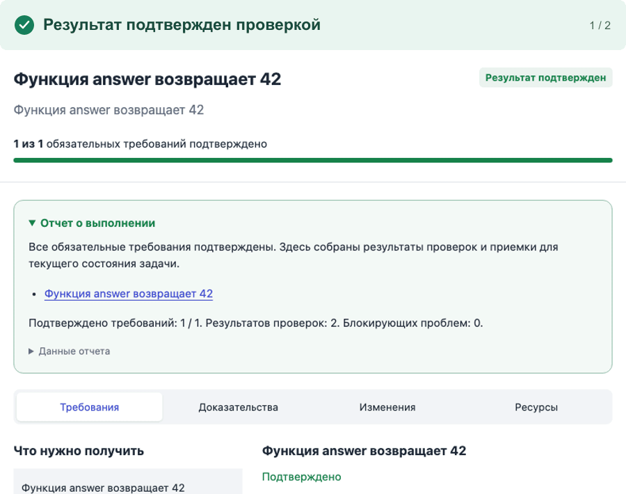
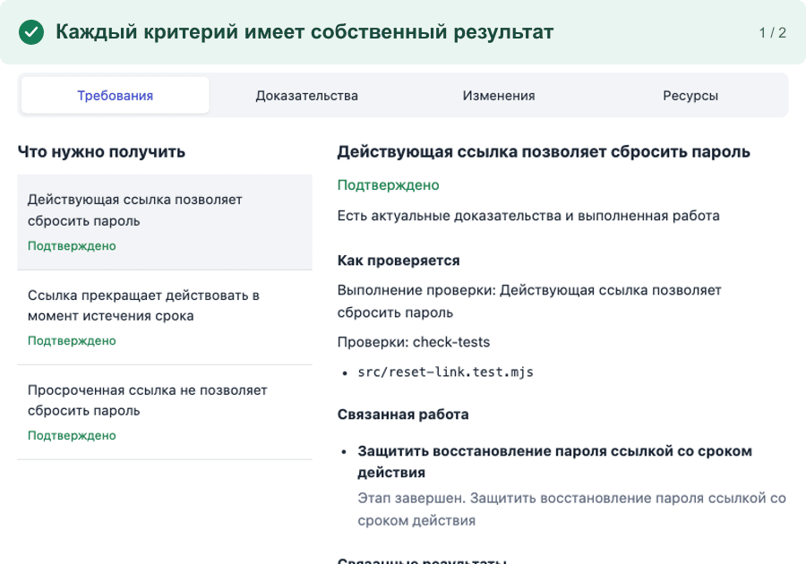

<p align="center">
  
</p>

<p align="center">
  <a href="#попробовать"><strong>Попробовать</strong></a> ·
  <a href="#как-это-работает">Как это работает</a> ·
  <a href="docs/README.md">Документация</a> ·
  <a href="CONTRIBUTING.md">Участие</a>
</p>

<p align="center">
  <a href="https://github.com/IgorBabikov/flowcairn/actions/workflows/ci.yml"></a>
  <a href="LICENSE"></a>
  <a href="docs/INSTALLATION.md"></a>
</p>

# Flowcairn

**Дайте Flowcairn сложную задачу. Он разложит ее, выполнит, проверит каждый критерий и покажет доказательства того, что результат действительно готов.**

Опишите результат. Flowcairn сохранит цель и **сам разобьет большую задачу на связанные подзадачи**, чтобы не потерять требования и порядок работы. Посмотрите получившийся план и подтвердите его. После этого система автономно выполняет разрешенную работу, ищет проблемы, исправляет их и перепроверяет затронутые требования. Когда вы вернетесь, на одном экране будут видны готовое, оставшееся и проверки каждого результата. Вам не придется управлять моделями, рисовать граф или читать длинные AI-логи.

Вы просматриваете итог как понятное код-ревью и решаете только то, что действительно требует человека. Если результат не удалось проверить, Flowcairn прямо скажет об этом вместо успокаивающего «готово».

Это полезно и тому, кто ставит продуктовую задачу, и разработчику, который будет принимать изменения. **Сегодня полноценное автоматическое исполнение рассчитано на разработку в существующем Git-проекте на Node.js.** Общая модель задачи и проверок подходит и для других видов сложной работы; готовые исполнители для них еще не заявлены.

**Задача завершена только тогда, когда для каждого обязательного требования есть подходящая актуальная проверка.** Успешный ответ AI, зеленый этап графа или сам факт изменения файла этого не заменяют.

<p align="center">
  <picture>
    <source media="(prefers-reduced-motion: reduce)" srcset="docs/assets/flowcairn-demo-still.png">
    
  </picture>
</p>

<p align="center"><small>Тестовая задача о сроке действия ссылки для сброса пароля. Интерфейс, локальный исполнитель и проверки настоящие; ответы AI в демонстрации заданы заранее.</small></p>

## Как это работает

1. **Опишите большую задачу своими словами.** Flowcairn выделит цель и обязательные требования, затем качественно разобьет работу на подзадачи: у каждой будут ожидаемый результат, зависимости и способ проверки.
2. **Посмотрите план и подтвердите его.** Декомпозиция помогает системе удерживать зависимости и проверять работу по частям. После вашего согласия Flowcairn сам выполнит подзадачи в нужном порядке, запустит разрешенные проверки и исправит обнаруженные проблемы в установленном пределе.
3. **Вернитесь к понятному результату.** По каждому требованию видно, какая работа сделана, что проверено и нужно ли ваше решение.

Если проверка не выполнена или результат изменился после нее, требование снова становится неподтвержденным. Общий статус **PROVEN** появляется только при полном актуальном покрытии обязательных требований без открытых блокирующих замечаний.

[Подробно о выполнении и проверках →](docs/HOW-FLOWCAIRN-WORKS.md)

## Главный экран — задача

Сначала видны цель, ход работы, требования и проблемы. Проверки, изменения, расход AI и граф зависимостей открываются по мере необходимости. Граф помогает исследовать исполнение, но не управляет правами и не решает, завершена ли задача: это делает локальный исполнитель.

<p align="center">
  <picture>
    <source media="(prefers-reduced-motion: reduce)" srcset="docs/assets/flowcairn-requirements-still.png">
    
  </picture>
</p>

<p align="center"><small>Откройте требование и увидите его проверку и связанную работу. После изменения файла старое подтверждение не остается зеленым.</small></p>

> **Пример большой задачи:** «Добавь восстановление доступа по email. Ссылка должна работать до окончания срока, после этого перестать действовать, а пользователь — понимать, что произошло». На кадрах выше показана одна проверенная часть такого задания: три отдельных критерия срока действия ссылки и то, как система снимает прежнее подтверждение после изменения кода.

## Попробовать

Нужны **Node.js 22**, Git, существующий проект на Node.js и настроенный локальный AI-клиент. На macOS поддерживается Codex CLI; доступность Claude Code и Cursor зависит от установленного и авторизованного клиента. [Платформы и ограничения](docs/INSTALLATION.md).

В терминале **своего проекта**:

```sh
npm install -D flowcairn
npx flowcairn
```

Первый запуск покажет настройку и откроет локальный интерфейс. До изменений кода вы увидите план и границы доступа. Проектные команды `test`, `lint`, `typecheck` и `build` включаются только в выбранном режиме проверок.

Если опубликованный npm-пакет еще отстает от `main`, текущий код можно установить в своем проекте без клонирования репозитория: `npm install -D github:IgorBabikov/flowcairn#main`.

[Установка и настройка →](docs/INSTALLATION.md) · [Первая задача →](docs/FIRST-TASK.md) · [Пакет в npm](https://www.npmjs.com/package/flowcairn)

## Границы доверия

Flowcairn сохраняет состояние локально, отделяет исходники своего пакета от проекта, ограничивает доступ AI к файлам и требует согласования плана перед изменениями. Неизвестный результат процесса останавливает работу для восстановления. Для незнакомого кода выбирайте проверки в Docker; режим `trusted-local` запускает скрипты с правами вашей учетной записи и требует отдельного согласия.

Перед записью Flowcairn показывает план и ждет вашего подтверждения. Изменения в текущем выпуске находятся в выделенной Git-копии внутри проекта и не переносятся автоматически в открытую рабочую ветку. [Ограничения текущего выпуска](docs/LIMITATIONS.md).

Статус **PROVEN** относится к записанным требованиям и выбранным способам проверки. Он не означает, что проверены все возможные сценарии или выполнен выпуск в production. Коммит, отправка в Git, публикация и развертывание остаются отдельными действиями.

[Безопасность](SECURITY.md) · [Возможности и ограничения](docs/LIMITATIONS.md) · [Что проверено в этой версии](docs/VERIFICATION.md)

## Документация и участие

| Начать | Разобраться глубже |
| --- | --- |
| [Первая задача](docs/FIRST-TASK.md) | [Архитектура](docs/ARCHITECTURE.md) |
| [Установка](docs/INSTALLATION.md) | [Контракт и статусы](docs/FLOWCAIRN-WORKFLOW.md) |
| [Настройки](docs/CONFIGURATION.md) | [Проверки и их границы](docs/VERIFICATION.md) |
| [Инструкции и Skills](docs/SKILLS.md) | [Решение проблем](docs/TROUBLESHOOTING.md) |

Нашли воспроизводимую ошибку? [Создайте issue](https://github.com/IgorBabikov/flowcairn/issues/new/choose). Хотите помочь? Начните с [CONTRIBUTING.md](CONTRIBUTING.md). Уязвимости сообщайте по [политике безопасности](SECURITY.md).

[Личный Telegram-канал основателя Flowcairn](https://t.me/Babikov_build)

Flowcairn распространяется по лицензии [MIT](LICENSE).
