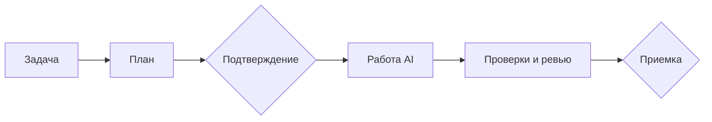

<p align="center">
  
</p>

# Flowcairn

**Видите, что AI делает с вашим проектом, и решаете, что принять.**

Flowcairn добавляет в Git-проект понятный рабочий процесс: план → ваше подтверждение → работа AI в отдельной копии → проверки → ревью → приемка. ReactFlow показывает реальное состояние исполнения; разрешения и результаты контролирует локальный runtime.

[](https://github.com/IgorBabikov/flowcairn/actions/workflows/ci.yml)
[](LICENSE)
[](docs/INSTALLATION.md)

## Как выглядит работа


На изображении — контролируемый снимок из UI-теста, показывающий новое оформление состояний.

Каждый этап показывает действие, статус, попытку и доказательства. Выполняющийся узел выделяется, входящая активная связь показывает движение работы. При настройке «уменьшить движение» анимация отключается; текст и статическое выделение остаются.

## Зачем Flowcairn

- **Понять, где остановилась задача.** Видны текущий этап, зависимости и причина блокировки.
- **Ограничить работу AI.** Вы задаете разрешенные файлы. Изменения применяются в отдельном worktree.
- **Проверить результат.** Измененные файлы, проверки и ревью связаны с конкретной попыткой.
- **Сохранить контроль.** Неопределенный результат не повторяется вслепую. Приемка не делает commit, push или deploy.

## Быстрый старт

Нужны **Node.js 22, Git и существующий npm/pnpm-проект**. Для выполнения проверок потребуется Docker; для AI — свой доступ к [поддерживаемому провайдеру](docs/INSTALLATION.md#выбрать-ai-провайдера).

В корне своего проекта на **macOS**:

```bash
npm install --save-dev "git+https://github.com/IgorBabikov/flowcairn.git#main" --ignore-scripts
npx --no-install flowcairn init
```

На **Linux** после той же команды установки используйте `npx --no-install flowcairn init --provider openai` и настройте свой API-ключ по [инструкции](docs/INSTALLATION.md#openai-api). Codex-исполнитель сейчас рассчитан на macOS.

`init` задаст минимальные вопросы в терминале и создаст конфигурацию сам. Повторный запуск сохраняет существующие настройки. Установка не заменяет ваши `AGENTS.md` и hooks, не запускает AI и не делает commit.

Здесь устанавливается текущая ветка `main` с готовым интерфейсом; lockfile фиксирует выбранный Git-коммит. Нового релиза для этих изменений нет. Сборка при установке и `postinstall` не нужны. [Другие способы установки и точные настройки](docs/INSTALLATION.md).

## Первая задача

Начните с одного небольшого результата:

```bash
npx --no-install flowcairn task --id ORCH-001 --goal "Уточнить описание проекта" --scope README.md --accept "Назначение проекта понятно из первого абзаца" --snapshot
npx --no-install flowcairn ui
```

`--snapshot` явно разрешает использовать текущие изменения проекта в исходном снимке первой задачи. Не включает новые файлы автоматически: при необходимости укажите их через `--include-untracked`. Например, для нового lockfile добавьте `--include-untracked package-lock.json`. Следующие задачи требуют чистого Git-состояния.

Откройте ссылку из терминала. Вы увидите сохраненный граф, ожидающий подтверждения плана. Выберите этап, проверьте файлы и разрешения. Перед выполнением подготовьте проверки командой `npx --no-install flowcairn checks prepare`; она может загрузить Docker-образ и зависимости.

После выполнения изучите изменения, результаты тестов и ревью. Примите результат, затем передайте его в обычный Git-процесс вашей команды. [Полный сценарий первой задачи](docs/FIRST-TASK.md).



## Документация

[Установка](docs/INSTALLATION.md) · [Первая задача](docs/FIRST-TASK.md) · [Настройки](docs/CONFIGURATION.md) · [Восстановление](docs/TROUBLESHOOTING.md) · [Архитектура](docs/ARCHITECTURE.md) · [Что проверено](docs/VERIFICATION.md) · [Ограничения](docs/LIMITATIONS.md)

Это ранняя версия для ограниченных задач. Зеленый граф не гарантирует отсутствие ошибок; финальный результат проверяете вы. Об уязвимости сообщайте [приватно](SECURITY.md). Для участия: [CONTRIBUTING](CONTRIBUTING.md). Лицензия [MIT](LICENSE), [лицензии компонентов](THIRD_PARTY_NOTICES.md).

## Основатель

[Личный Telegram-канал основателя Flowcairn](https://t.me/Babikov_build)
