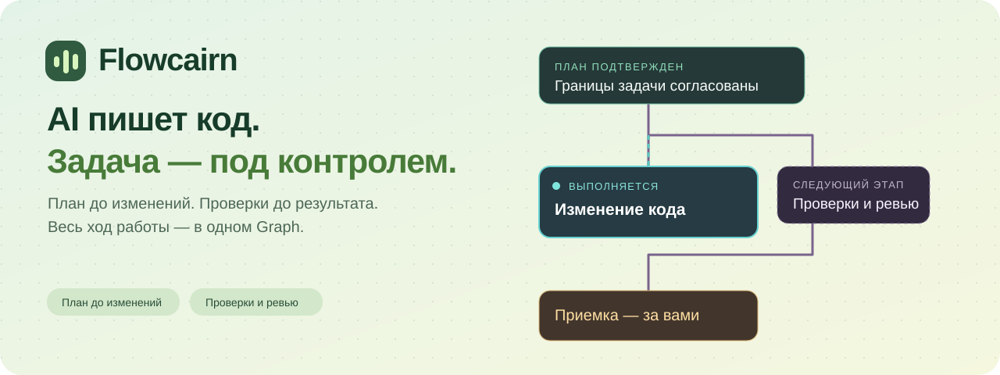
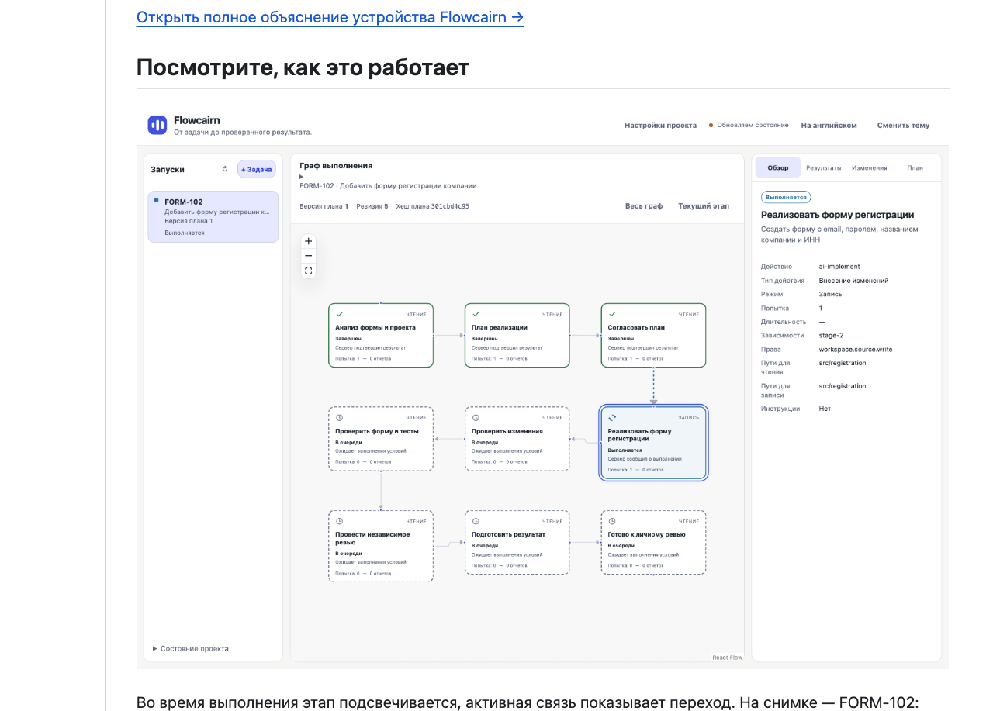
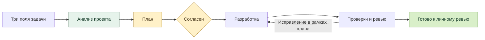

<p align="center">
  
</p>

<p align="center">
  <a href="#быстрый-старт"><strong>Установить</strong></a> ·
  <a href="#когда-задача-становится-больше-чата">Как помогает</a> ·
  <a href="#первая-задача">Первая задача</a> ·
  <a href="docs/README.md">Документация</a>
</p>

<p align="center">
  <a href="https://github.com/IgorBabikov/flowcairn/actions/workflows/ci.yml"></a>
  <a href="https://www.npmjs.com/package/flowcairn"></a>
  <a href="LICENSE"></a>
  <a href="https://github.com/IgorBabikov/flowcairn/releases"></a>
  <a href="docs/INSTALLATION.md"></a>
</p>

# AI-разработка, которой можно управлять

**Когда задача становится больше одного промпта, чат перестает быть управлением разработкой.** Flowcairn превращает ее в понятный Graph: анализ, план, одно согласование, изменения, проверки, ревью и приемка.

Он устанавливается рядом с существующим Git-проектом и показывает, что происходит, почему работа остановилась и чем подтвержден результат.

React Flow рисует граф. Локальный runtime управляет исполнением, разрешениями и сохраненным состоянием.

## Когда задача становится больше чата

| Обычно с AI | С Flowcairn |
| --- | --- |
| Требования растворяются в длинной переписке | До изменений есть короткий план с этапами и зависимостями |
| Непонятно, что AI уже успел изменить | Видны текущий этап, измененные файлы и причина остановки |
| Проверки и ревью остаются последним сообщением в чате | Проверки, ревью и приемка — обязательные этапы Graph |
| Сложно безопасно продолжить после ошибки | Runtime предлагает только разрешенные действия: повтор, восстановление или новый план |

**Первый полезный момент:** вы видите план до изменения кода, а после работы — не обещание AI, а diff, проверки и evidence.

## Посмотрите, как это работает



Во время выполнения этап подсвечивается, активная связь показывает переход. На снимке — завершенная приемка формы с проверкой данных. Цвет дополняется текстом; уменьшенное движение поддерживается. [Что проверено](docs/VERIFICATION.md).

| Вам нужно | Flowcairn показывает |
| --- | --- |
| Понять план до изменения кода | Этапы, зависимости и границы задачи |
| Контролировать работу AI | Текущий этап, остановку, ошибку и безопасные варианты продолжения |
| Проверить результат | Измененные файлы, diff, проверки и отдельное ревью |
| Передать результат человеку | Готовый маршрут личного ревью с фактами по каждому этапу |

## Быстрый старт

**Нужны:** Node.js 22, Git-проект с первым коммитом и доступ к AI. Для проверок нужен Docker. Подтвержденные менеджеры: npm, pnpm и Yarn 4 с `node_modules`. [Платформы и ограничения](docs/INSTALLATION.md).

В терминале **своего проекта**:

```bash
npm install -D flowcairn@latest
npx flowcairn
```

1. **Установка** добавляет готовый пакет с интерфейсом. Собирать React Flow самому не нужно.
2. **Первый запуск** предложит короткую настройку и откроет UI.
3. **Дальше** заполните три поля задачи — никаких JSON-файлов.

Пакет: [flowcairn в npm](https://www.npmjs.com/package/flowcairn).

<details>
<summary><strong>Установка через pnpm</strong></summary>

```bash
pnpm add -D flowcairn@latest
pnpm exec flowcairn
```

В pnpm workspace из корня используйте `pnpm add -Dw flowcairn@latest`. Команда `pnpm install flowcairn` устанавливает зависимости проекта, а не добавляет Flowcairn.

</details>

<details>
<summary><strong>Модель, Docker, Linux, Yarn и другие способы</strong></summary>

На macOS по умолчанию используется Codex, на Linux — OpenAI API. Нужен ваш доступ к поддерживаемому провайдеру; ключ не вводится в поле ID модели.

Для выполнения настроенных проверок подготовьте окружение:

```bash
npx flowcairn checks prepare
```

Команда может загрузить Docker-образ и зависимости. Она не запускает AI.

Нативный Windows и Bun пока не поддерживаются. Для WSL2 есть проверки среды, но полный запуск на реальном Windows-хосте еще не подтвержден.

[Все способы установки и настройка AI →](docs/INSTALLATION.md)

</details>

## Первая задача

В интерфейсе всего три поля: **заголовок, описание и номер задачи**. Например:

> Добавь форму регистрации с email, паролем и подтверждением пароля. Для компании показывай название и ИНН. Объясняй ошибки рядом с полями, сохраняй введенные данные и блокируй повторную отправку.

1. Нажмите **«Запустить»**. Первый этап анализирует проект и задачу.
2. Второй этап составляет план и показывает его справа. Напишите уточнение, если что-то нужно изменить — анализ и контекст сохранятся.
3. Нажмите **«Согласен»**. Дальше идут реализация, проверки, ревью и разрешенные исправления.
4. Дождитесь **«Готово к личному ревью»**, проверьте изменения и сами подготовьте commit и PR.

Повторных штатных согласований после плана нет. Неизвестный результат, выход за разрешенные границы или исчерпанный лимит остановят работу с объяснением.

[Пройти весь сценарий с объяснениями →](docs/FIRST-TASK.md)



## Если что-то пошло не так

**Ошибка** означает известный неуспех. **Неопределенность** означает, что результат или остановка не доказаны. Flowcairn не смешивает эти состояния и не предлагает небезопасный повтор. После изменения плана или правил требуется новая версия и подтверждение.

```bash
npx flowcairn doctor
```

[Ошибки и восстановление →](docs/TROUBLESHOOTING.md) · [Ограничения →](docs/LIMITATIONS.md)

<details>
<summary><strong>Как отключить Flowcairn</strong></summary>

Закройте UI, завершите активные операции и выполните:

```bash
npx flowcairn uninstall
```

Удаляются только неизмененные файлы установки и управляемые инструкции. Результаты, история и рабочие копии сохраняются; команда перечислит остатки. Зависимость пакета удаляется отдельно менеджером пакетов, например `npm uninstall flowcairn`.

</details>

## Документация и участие

| Начать работу | Разобраться глубже |
| --- | --- |
| [Установка и провайдеры](docs/INSTALLATION.md) | [Архитектура](docs/ARCHITECTURE.md) |
| [Первая задача](docs/FIRST-TASK.md) | [Стандарт Graph + React Flow](docs/GRAPH-REACTFLOW-STANDARD.md) |
| [Качество работы](docs/SKILLS.md) | [Проверки и их границы](docs/VERIFICATION.md) |
| [Настройки](docs/CONFIGURATION.md) | [Безопасность](SECURITY.md) |

Нашли воспроизводимую проблему? [Создайте issue](https://github.com/IgorBabikov/flowcairn/issues/new/choose). Хотите помочь кодом или документацией? Начните с [CONTRIBUTING](CONTRIBUTING.md). Уязвимости сообщайте по [security policy](SECURITY.md).

## Основатель

**[Личный Telegram-канал основателя Flowcairn](https://t.me/Babikov_build)**

Лицензия [MIT](LICENSE).
