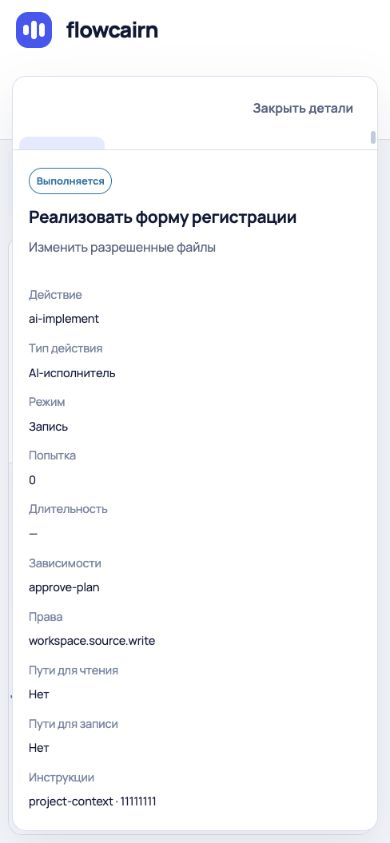
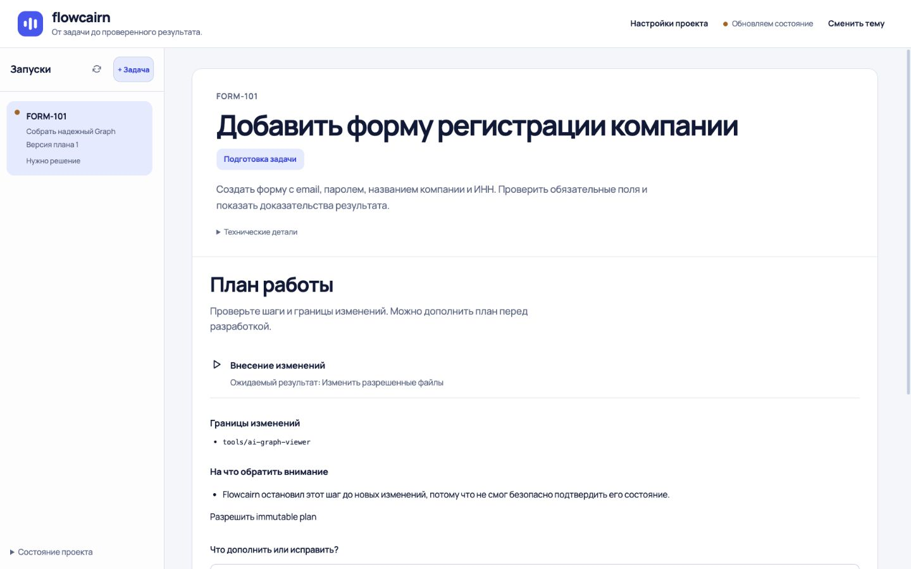
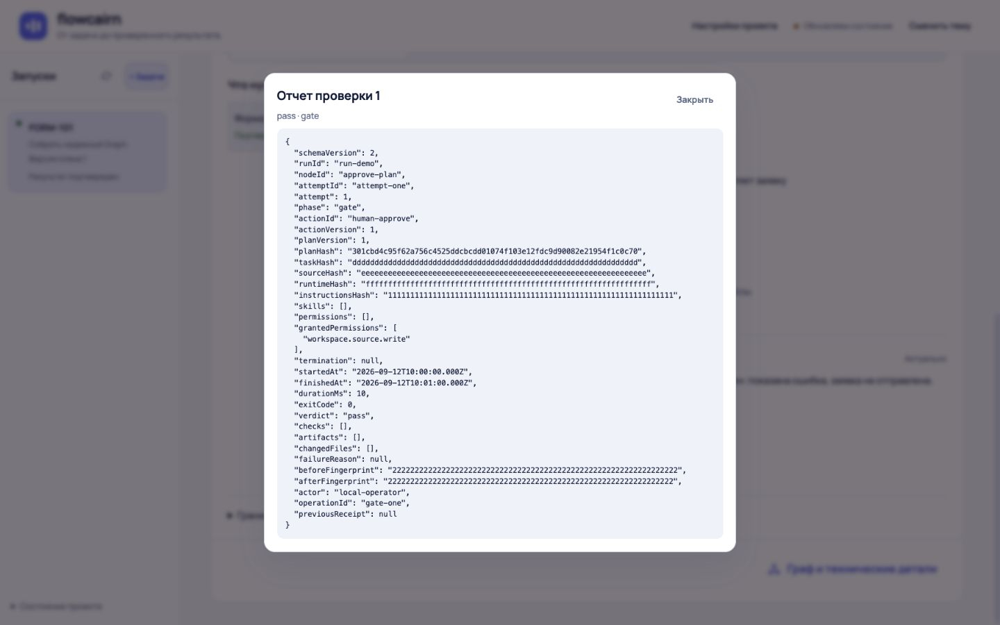

# UI/UX-аудит Flowcairn — 23 сентября 2026

Главный вывод: спокойная визуальная основа уже есть, но ориентация нарушена размещением навигации, следующего действия и технических панелей. Нужна перестройка приоритетов внутри существующего интерфейса. Полный визуальный редизайн не требуется.

Главный экран должен отвечать: **какая задача → что происходит → что сделать дальше → чем подтвержден результат**. Граф объясняет исполнение и не заменяет задачу, критерии и доказательства.

## Основание и границы

- Просмотрены все шесть предоставленных референсов. Применены AI-WORKFLOW и проектные правила, Product Design Audit.
- Проверена свежая сборка исходников версии 0.3.7, `main`, commit `eecfcb7`. Сборка успешна на Node 22.13.1.
- Интерфейс просмотрен и использован в браузере Codex через Computer Use: реальные клики, прокрутка, переключение вкладок, Escape, ввод текста, смена темы.
- **Это реальный frontend с синтетическими ответами API из тестовых fixtures проекта.** AI, рабочие задачи пользователя и изменения исходников через executor не запускались. Это проверка отображения и взаимодействий, а не сквозная проверка executor.
- Проверенные CSS viewport: 1440×900, 1366×768, 1093×614, 390×844; дополнительно исходный размер вкладки. Размеры проверялись через DOM: override браузера масштабировался с DPR 1.25. Имя снимка `04-graph-laptop` историческое: фактическая ширина там 1093, не 1366.
- Сохранены 32 принятых снимка, просмотрены также из сохраненных файлов. [Галерея всех снимков](GALLERY.md).
- Исходники UI не изменялись. Созданы только отчет, снимки и запрошенный `STATUS.md`; сборка обновляла локальный dist.

Не проверены: реальная длительная AI-операция, фактическая остановка дочернего процесса, первая установка с авторизацией провайдера, все виды отказов сети, ручная приемка требования, уточнение контекста, большие графы и длинные списки запусков, физическое мобильное устройство, screen reader и полное соответствие accessibility-стандартам.

## Что сохранить из референсов

| Референс | Полезный прием | Как применять |
|---|---|---|
| `download.png` | Задача — главный объект, описание этапа понятным языком | Сохранить task-first подход; уменьшить высоту вступления |
| `download (1).png` | Заметный переключатель представления и связь графа с деталями | Постоянные вкладки «Задача / Граф», локальная кнопка деталей |
| `exec-c24c1ec0…png` | Один текущий этап, будущие шаги тише, описание сворачивается | Текущий этап сразу под названием; подробное описание по запросу |
| `exec-a718814d…png` | Загрузка сохраняет общий каркас | Один каркас задачи до и после получения snapshot |
| `exec-3dbe20c8…png` | Простая форма, одно главное действие, объяснение последствий | Короткая форма с видимой кнопкой «Начать анализ» |
| `exec-1676a0b8…png` | Остановка объяснена отдельно; технические разделы сгруппированы | Один блок состояния и понятное восстановление; детали раскрываются |

Не переносить механически: приблизительный процент готовности, аватары/уведомления без функции, декоративные иконки, еще одну страницу «технических деталей». Важнее постоянное расположение и понятные названия.

## Пройденные шаги

| № | Шаг | Состояние опыта | Снимки |
|---|---|---|---|
| 1 | Новая задача, ввод названия и описания | Форма понятна; обязательный номер и disabled-кнопка плохо объяснены | 01, 28, 29 |
| 2 | Просмотр плана и поиск согласования | Главное действие ниже первого экрана | 07, 08 |
| 3 | Выполнение задачи | Статус повторяется; текущий этап расположен слишком низко | 02, 23 |
| 4 | Переход в граф, выбор деталей, закрытие | Переключатель меняет место; закрытие не сохраняется | 03–05, 21, 22, 33 |
| 5 | Состояние проекта | Находится внизу; не содержит видимой краткой сводки до раскрытия | 06 |
| 6 | Настройки | Открываются, но вытесняют рабочую область | 09 |
| 7 | Подтвержденный результат, требование и evidence | Связь с доказательством есть; много повторов до конкретного результата | 10, 11 |
| 8 | Отчет проверки и возврат через Escape | Диалог работает, фокус возвращается; содержимое — JSON | 12 |
| 9 | Изменения и ресурсы задачи | Открываются; ресурсы перегружены отсутствующими данными | 13, 14 |
| 10 | Устаревшее подтверждение | Готовность снимается и причина видна; дальнейший шаг неочевиден | 31 |
| 11 | Остановка, остановлено, остановка не подтверждена | Состояния различимы текстом; следующий шаг и выравнивание требуют исправления | 16, 17, 30 |
| 12 | Мобильная задача и список запусков | Нет общей горизонтальной прокрутки на 390 px; нет создания новой задачи в списке | 18, 19 |
| 13 | Мобильные детали | Панель перекрывает граф, вкладки обрезаны, Escape не закрывает | 20–22 |
| 14 | Темная тема | Отдельной поломки на просмотренных экранах не обнаружено | 23, 24 |
| 15 | Результаты, история, план в деталях графа | «Изменения» означает историю; «План» пуст в autonomous-задаче | 25–27 |
| 16 | Отложенная загрузка snapshot | До задачи временно показывается каркас графа | 32 |

## Существенные замечания

### 1. P0 — «Задача / Граф» должны оставаться на одном месте

**Где:** экран задачи и переход в граф, снимки 02, 08, 11, 33. На задаче переход расположен в нижнем footer. Только после перехода появляется навигация сверху.

**Почему мешает:** пользователь не видит доступные представления и вынужден искать обратный маршрут в другом месте. Длинный результат отодвигает граф на несколько экранов.

**Исправление:** постоянная строка вкладок **«Задача» / «Граф»** непосредственно под компактной шапкой выбранной задачи, в обоих режимах. Высота 44 px, явный активный tab. Убрать нижний дублирующий переход. «Задача» остается режимом по умолчанию. «Детали исполнения» — отдельная локальная кнопка рядом с управлением графом, а не часть длинного названия второй вкладки.

**Референс:** постоянный переключатель из `download (1).png`, раскрытие сложности по запросу. **Источник:** `App.tsx:880`, `TaskOverview.tsx` footer.

### 2. P0 — «Состояние проекта» скрыто, а сам проект не обозначен

**Где:** нижний левый угол, снимки 06, 19, 33. В мобильном UI до него нужно открыть список запусков. В шапке нет имени выбранного проекта.

**Почему мешает:** сложно понять, с каким проектом работаешь и готов ли исполнитель. «Обновляем состояние» — связь интерфейса, а не готовность проекта; зеленая целостность — не готовность результата.

**Исправление:** рядом с брендом показывать **имя проекта + краткий статус «Готов к работе» / «Нужна настройка» / «Есть проблема»**. Кликабельная сводка раскрывает «Состояние проекта»: AI, проверки, целостность и причину проблемы. На мобильном — компактная строка под названием проекта, без необходимости открывать запуски. Сводный статус брать из подтвержденных полей backend; неизвестность показывать явно. Полный путь, хеши и время последнего snapshot оставить в деталях. Удалить прежний нижний дубль.

**Референс:** легкая ориентация и один заметный текущий контекст. **Источник:** `App.tsx:925,1120`, `ui-controls.tsx` RunHealth. Сейчас этот блок описывает snapshot выбранного запуска; не выдавать его за агрегированную оценку всего репозитория.

### 3. P0 — закрытые детали самопроизвольно возвращаются

**Где:** узкий граф, снимки 05→06 и 21→22. После «Закрыть детали» панель исчезает и затем появляется без выбора узла.

**Почему мешает:** пользователь не может устойчиво освободить граф; интерфейс отменяет его решение.

**Исправление:** разделить `selectedNodeId` и открытость панели. Snapshot может обновлять выбранный узел, но не открытость. Открывать панель только явным нажатием узла/«Детали исполнения»; при смене задачи применять один определенный default. Проверка: закрыть, получить несколько обновлений той же и новой revision — панель остается закрытой.

**Причина подтверждена кодом:** `App.tsx:259` заново выбирает active/первый узел, когда selection = null; наличие selectedNode управляет рендером панели на строке 1038. Снимки показывают соответствующее поведение.

### 4. P0 — мобильная панель деталей визуально сломана

**Где:** 390×844, снимки 20, 22. Панель перекрывает навигацию и граф; видна лишь часть фона вкладки, тексты вкладок обрезаны.

**Почему мешает:** пользователь не видит, какой раздел открыт и как перейти к результатам. Escape оставляет панель открытой, фокус при открытии не переводится внутрь.

**Исправление:** на мобильном использовать полноценный dialog/sheet с тремя строками **заголовок и закрытие / вкладки / прокручиваемое содержимое**. Grid: `auto auto minmax(0, 1fr)`. Видимый заголовок «Детали исполнения» и имя этапа. Прокручивать только body, высота контролов не менее 44 px. Escape закрывает, фокус возвращается к инициатору; у modal фон недоступен. На широком экране сохранить боковую панель, предусмотреть сворачивание.

**Причина:** `app.css:721` задает две grid-строки, а compact-панель имеет три прямых элемента. `App.tsx:1038` использует aside с role=dialog без жизненного цикла modal; работающий диалог отчета в `ExecutionDialogs.tsx` дает готовый внутренний образец. **Референс:** связность графа и деталей из `download (1).png`, адаптированная к узкому экрану.

### 5. P0 — на мобильном отсутствует создание следующей задачи

**Где:** шапка и окно «Запуски», снимки 18, 19. После появления существующей задачи нет «+ Задача» ни в шапке, ни в окне списка.

**Почему мешает:** основной сценарий нельзя повторить обычным путем из проверенного мобильного интерфейса.

**Исправление:** добавить «Новая задача» в заголовок мобильного списка; одинаковый обработчик и capability с desktop-кнопкой. При недоступности объяснять причину. По нажатию закрыть список, показать composer, перевести фокус на заголовок. Проверить создание второй задачи при ширинах 390 и 720 px.

**Источник:** mobile dialog `App.tsx:1102`, desktop rail скрывается в media-query до 720 px. **Референс:** явный вход в новую работу из `exec-3dbe20c8…png`.

### 6. P0 — следующий шаг оторван от состояния задачи

**Где:** план 07–08, неподтвержденная остановка 17, stale 31. «Согласен» ниже первого экрана; в uncertain написано «Проверьте состояние», но рядом нет соответствующего перехода или действия.

**Почему мешает:** пользователь понимает сообщение, но не понимает, куда нажать. В согласовании короткое «Согласен» не объясняет последствия.

**Исправление:** единый блок под названием **состояние → конкретная причина/текущий этап → одно доступное главное действие**. Для плана: «Согласовать и начать выполнение», ведущая к существующему подтверждению прав. Поле «Предложить изменения» раскрывать по запросу. Кнопка доступна на первом экране и в нижней закрепленной строке длинного плана. Для uncertain — «Проверить остановку» только при разрешенной capability; иначе конкретная причина и путь в нужный отчет. Для stale — доступная перепроверка либо точная инструкция, если backend ее не разрешает. Не добавлять обход gates и не предлагать повторный запуск при неизвестном живом процессе.

**Референс:** один понятный следующий шаг в `exec-1676a0b8…png`. **Источник:** `TaskOverview.tsx`, `ExecutionStatus.tsx`, `WorkflowPanel.tsx`. Замечание относится к навигации и объяснению; доступность реального recovery не проверялась.

### 7. P1 — чрезмерная высота заголовка и повторы статуса

**Где:** 02, 16–18, 23. Название, badge, описание, технические детали, отдельный повторный статус, затем карточка этапа. На мобильном текущий этап ниже первого экрана.

**Почему мешает:** интерфейс тратит первый экран на сообщение «работаем», а конкретная работа оказывается ниже. «Воздух» перестает помогать чтению.

**Исправление:** desktop-заголовок 28–32 px вместо текущего максимума около 45 px; mobile 24–28 px. Отступы шапки 24 px desktop / 16–20 px mobile. Короткое описание максимум две строки, остальное под «Описание задачи». Хеш/ревизию убрать из верхней части в технические сведения. Объединить badge и повторный banner в один блок с названием активного этапа. Один счетчик «2 из 7 этапов» вместо повторов. Прогресс этапов не называть готовностью результата.

**Референс:** текущий этап и свернутое описание из `exec-c24c1ec0…png`. Предложенные размеры — целевые стартовые значения, их нужно проверить после реализации.

### 8. P1 — «Детали исполнения» не имеют видимого собственного заголовка

**Где:** боковая панель 24, 33. Визуально она начинается с «Обзор / Результаты / Изменения / План», далее идут machine IDs и технические поля.

**Почему мешает:** неясно, что это детали выбранного этапа, а не всей задачи. Основная функция панели теряется среди атрибутов реализации.

**Исправление:** верх панели: «Детали исполнения» (16–18 px), имя этапа, статус; затем коротко «Что делает / результат / следующий переход». Права, action ID, зависимости-ID и hashes собрать в закрытый раздел «Технические сведения». Не скрывать существенные запрашиваемые права в момент согласования. Пустые поля «Нет»/«—» показывать только когда отсутствие важно.

**Референс:** группировка технических сведений по необходимости из `exec-1676a0b8…png`.

### 9. P1 — вкладка «План» открывает пустую панель

**Где:** 27, autonomous-задача.

**Почему мешает:** активная вкладка выглядит как потерянные данные или сломанная загрузка.

**Исправление:** для autonomous-задачи показывать текущий план с его этапами и ограничениями либо заменить вкладку понятным переходом «Открыть план задачи». Если раздел не применим, убрать вкладку, а не оставлять пустой body. Не показывать редактор старого графа как замену текущему продукту.

**Подтверждение:** вкладки рендерятся без фильтра в `App.tsx:1045`, но тело «План» только при `snapshot.workflow !== 'autonomous'` на строке 1086. Это подтверждено кодом, а не только отсутствием данных стенда.

### 10. P1 — «Изменения» имеет два разных значения

**Где:** 13 и 26. На задаче это измененные файлы. В деталях это история ревизий всех узлов с `r3`, `approve-plan`, `implement`.

**Почему мешает:** один термин обещает diff, а открывает журнал состояния. Пользователь дополнительно должен расшифровывать IDs.

**Исправление:** в деталях переименовать вкладку в «История». Показать человекочитаемые названия этапов и события; явно обозначить, что журнал относится ко всей задаче, либо фильтровать по выбранному этапу. «Изменения» в задаче оставить для файлов и diff.

**Принцип:** одно название — одно назначение. **Источник:** `ExecutionDetails.tsx` EventHistory, `App.tsx` tab='history', `ui-copy.ts`.

### 11. P1 — результат объясняется повторениями вместо короткого итога

**Где:** 10–11. Подтверждение повторяется в шапке, счетчике, развернутом отчете, списке требований и деталях выбранного требования. Один критерий занимает почти два экрана.

**Почему мешает:** ценность «покажет доказательства готовности» присутствует, но ее трудно быстро прочитать.

**Исправление:** компактный итог «Подтверждено 1 из 1 требований» + что изменено + «Посмотреть доказательства». Ниже один список требований со статусами; по выбору — метод, результат, актуальность и источник. Не дублировать список требований внутри зеленого отчета. Сертификат и технические данные отчета свернуть. При нескольких требованиях выбирать требующее внимания; для PROVEN — давать краткую итоговую сводку.

**Референс:** ясная последовательность из `download.png`; минимум конкурирующих блоков. Сохранить отдельное различение завершенной работы и доказанного требования.

### 12. P1 — отчет проверки открывается сырым JSON

**Где:** 12, «Открыть отчет проверки».

**Почему мешает:** пользователь ищет доказательство результата, а получает служебные идентификаторы, hashes и англоязычный verdict.

**Исправление:** первым экраном отчета показать проверенный критерий, способ проверки, фактический результат, время, актуальность и ссылку на проверенное состояние. Затем логи/артефакты. Полный неизмененный receipt сохранить в «Исходные данные (JSON)», с копированием/скачиванием. Не подменять отсутствующие сведения пересказом AI.

**Референс:** скрытие технической сложности из `exec-1676a0b8…png`. **Источник:** `ExecutionDialogs.tsx`, отображение JSON evidence.

### 13. P1 — настройки разрушают рабочую компоновку

**Где:** 09. Большая карточка настроек вставляется между topbar и задачей; список и задача остаются узкими фрагментами внизу.

**Почему мешает:** теряется контекст, появляется сразу несколько независимых областей прокрутки. По названию ожидается редактирование, но показана преимущественно справка с инструкцией для терминала.

**Исправление:** отдельный dialog/drawer поверх сохраненной задачи либо отдельное представление с явным «Назад к задаче». Наверху назвать текущий проект и объяснить, что настройка меняется через CLI; дать копирование команды. Сгруппировать в «AI», «Проверки», «Доступ». Список альтернативных провайдеров свернуть. Не добавлять интерактивное изменение прав без соответствующего контракта backend.

**Источник:** `App.tsx:879`, `SetupPanel.tsx`. **Принцип:** вспомогательное действие не должно менять каркас основной работы.

### 14. P1 — номер задачи блокирует вход без объяснения

**Где:** 28–29. После заполнения названия и описания кнопка disabled; номер обязателен, но его обязательность и причина не поясняются. Подсказка предполагает наличие трекера.

**Почему мешает:** продукт обещает принять сложную задачу, но требует придумать внешний идентификатор даже пользователю без трекера.

**Исправление:** генерировать внутренний номер автоматически; внешний номер сделать необязательным полем «Номер в трекере». Это согласовать с контрактом intake, не просто убрать required в React. До изменения контракта явно подписать обязательность и причину disabled. Форму ограничить шириной примерно 800–880 px; уменьшить межполевые интервалы до 20–24 px, чтобы кнопка помещалась на ноутбуке. Accessible name должен совпадать с видимым «Начать анализ», сейчас aria-label — «Запустить».

**Источник:** `TaskComposer.tsx:21` и submit-button. **Референс:** простой вход из `exec-3dbe20c8…png`; необходимость номера в макете не является обоснованием продуктового ограничения.

### 15. P1 — загрузка меняет тип экрана

**Где:** 32. Когда список уже пришел, а snapshot задержан, появляется «Граф выполнения» и «На английском». После snapshot появляется основной экран задачи без этого переключателя языка.

**Почему мешает:** каркас прыгает, на первом входе показывается другой режим продукта.

**Исправление:** до получения snapshot сохранять skeleton именно task-first каркаса: rail, место заголовка, место состояния и контента. Отдельное состояние «Загружаем задачу»; не определять вид продукта по временно отсутствующему `workflow`. Не показывать ложную готовность из прошлого snapshot.

**Референс:** стабильная оболочка `exec-a718814d…png`. Тестовая задержка специально увеличена; наличие задержки само по себе не дефект.

### 16. P1 — блок продолжения после остановки выбивается из сетки

**Где:** 30. Текст и кнопка «Подготовить новый план» прижаты к внешнему левому краю карточки, в отличие от внутренних блоков с отступом.

**Почему мешает:** важное действие выглядит случайно вставленным и хуже связывается со статусом остановки.

**Исправление:** встроить продолжение в единый блок состояния с теми же горизонтальными отступами. Одно объяснение остановки вместо трех. Если действие запрещено, показать причину рядом; не обещать доступное продолжение через неактивную кнопку. В данном стенде disabled задан capability — сам запрет не считается дефектом executor.

**Источник:** `TaskOverview.tsx`, `.context-recovery`. **Референс:** цельная карточка состояния из `exec-1676a0b8…png`.

### 17. P2 — список запусков ставит служебный номер выше смысла

**Где:** 02, 19, 33. Крупнее всего номер; название меньше и обрезается, версия плана занимает отдельную строку.

**Почему мешает:** несколько похожих запусков придется узнавать по номерам и открывать по очереди.

**Исправление:** название задачи 14–15 px, две строки; номер и статус — вторичная строка. Версию плана показывать в истории/по запросу. Активную строку выделять одним фоном и aria-current. Словарь «Задачи / запуски / версии» определить явно; не переименовывать все механически, если список хранит несколько попыток одной задачи.

### 18. P2 — ресурсы и технические блоки слишком плотные по числу полей

**Где:** 14, 24, 33. Семь последовательных «Нет данных» о токенах/стоимости; множество тонких разделителей, пустые поля и мелкий технический текст.

**Почему мешает:** количество строк создает видимость информации, но усложняет поиск полезных значений.

**Исправление:** сверху ресурсы, которые известны: вызовы, длительность, стоимость при наличии. Для отсутствующих counters одна фраза «Исполнитель не передал токены и стоимость» с раскрываемой детализацией. Убрать повторные границы внутри одной смысловой группы. Общая шкала отступов 8/16/24/32 px, основной текст 14–16 px, вспомогательный 12–13 px. В графе сохранять читаемый масштаб выбранного этапа; миниатюрность всего графа не считать заменой читаемым деталям.

## Доступность: подтвержденное и непроверенное

Положительное: видимые focus rings у полей/кнопок; текстовые статусы дополняют цвет; у мобильного списка и receipt работают Escape и возврат фокуса; у просмотренной мобильной задачи нет горизонтального overflow.

Подтвержденные проблемы: aside «Детали исполнения» не закрывается через Escape и не получает фокус при открытии; обрезанные вкладки; имя submit-кнопки расходится с видимым текстом. У панели используются role=tab внутри nav без явно заданного tablist; полноценное управление стрелками и screen reader требует отдельной проверки. В отчете это не объявляется доказанным нарушением конкретного стандарта.

Контраст не измерялся инструментально. По темной теме проверены два экрана; отсутствие заметной поломки не означает полную доступность. Анимации и reduced-motion требуют отдельного сценария. Увеличение до 200% и реальные мобильные браузеры не проверены.

## Предлагаемое расположение трех ключевых элементов

| Зона | Содержимое | Приоритет и поведение |
|---|---|---|
| Верхняя оболочка | Flowcairn · имя проекта · **Состояние проекта** | Всегда видно; краткая сводка, детали по нажатию |
| Шапка задачи | Номер, название, один статус, текущий этап/блокер, одно главное действие | Самая заметная рабочая зона; помещается в первый экран |
| Под шапкой | **Задача / Граф** | Постоянное место, одинаковое во всех состояниях |
| Представление «Задача» | Текущий этап или итог → критерии → доказательства | Основной режим; служебные данные свернуты |
| Представление «Граф» | Граф, «Весь граф», «Текущий этап», **Детали исполнения** | Детали открываются по намерению пользователя; не конкурируют с итогом |
| Боковая область | Задачи/запуски + «Новая задача» | На мобильном тот же набор действий в доступном списке |

Это схема приоритетов, не новый экранный макет. Реализацию стоит начать с поведения и расположения; цвета и декоративные изменения оставить на конец.

## Короткий приоритетный план

**P0 — понятность и блокирующие взаимодействия:** постоянные «Задача / Граф»; видимое состояние и имя проекта; надежное закрытие и мобильная компоновка деталей; создание задачи на мобильном; главное действие рядом со статусом.

**P1 — существенное улучшение UX:** сократить шапку и дубли статусов; подписать и упростить детали; устранить пустой «План»; переименовать историю; показать человекочитаемый отчет; убрать настройки из потока задачи; объяснить номер и disabled-состояния; стабилизировать загрузку и выравнивание восстановления.

**P2 — полировка:** название задачи впереди номера; компактные ресурсы без повторов «Нет данных»; единая сетка отступов, типографика и границы.

## Как принять будущие изменения

1. На 1366×768 и 390×844 без прокрутки видно название проекта/задачи, текущее состояние и следующее действие либо явное «Действий не требуется».
2. «Задача / Граф» не меняют место; панель деталей не открывается сама после refresh.
3. Новую задачу можно создать при уже существующих запусках на desktop и mobile.
4. Вкладки деталей полностью видны, закрытие и Escape работают, фокус возвращается.
5. Нет пустых вкладок; одинаковое название не обозначает разные сущности.
6. Из требования до понятного доказательства — одно раскрытие/нажатие; технический receipt доступен отдельно.
7. PROVEN показывается только при актуальном backend evidence. Stale/uncertain не превращаются в успех; UI не расширяет capabilities.
8. После реализации провести короткий тест с новыми пользователями: за 5 секунд назвать проект, состояние и следующий шаг. Это критерий будущей проверки, а не измеренный результат данного экспертного аудита.

## Исключенные ложные сигналы

- Различия goal/title, английские названия артефактов и старые даты в fixtures не объявлялись дефектами реальных данных.
- Тестовый SSE закрывает поток; постоянное «Обновляем состояние» не использовалось как доказательство неисправности live-связи.
- Первый вариант stale-фикстуры оставлял старую reason-строку; он исключен. В отчете используется исправленный снимок 31.
- Попытки, durations, доступность действия и количество этапов задавались тестовыми данными. Они не доказывают runtime-ошибок.
- Пустой «План» сначала рассматривался как ограничение стенда, затем подтвержден условием рендера в исходниках.
