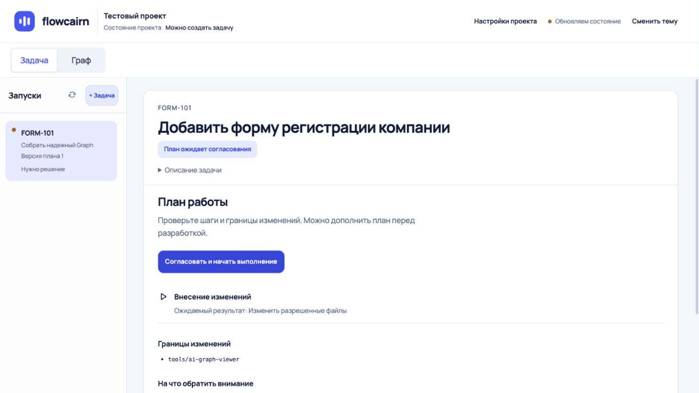
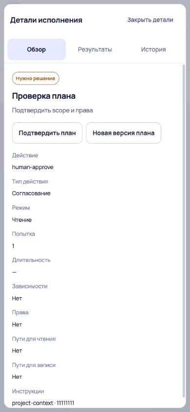
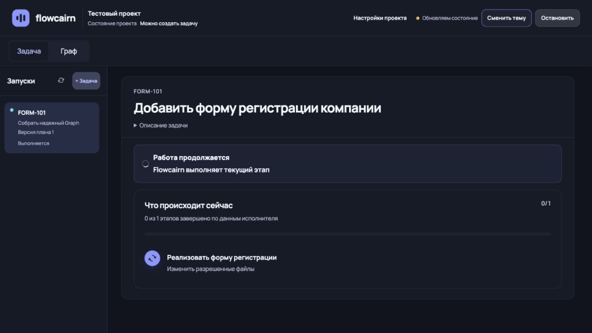

# Первый этап: P0 реализован

Исправления локальные, без commit/push/публикации. База аудита: 0.3.7, eecfcb7.

## Что изменено

| Пункт аудита | Результат |
|---|---|
| P0.1 — Задача / Граф | Постоянная строка навигации, одинаковое положение в обоих представлениях; нижний дубль удален |
| P0.2 — Состояние проекта | Имя и краткий статус в шапке, доступ к деталям на desktop/mobile; состояние выбранной задачи обозначено отдельно |
| P0.3 — самопроизвольные детали | Выбор узла и открытость панели разделены; refresh не открывает закрытую панель |
| P0.4 — мобильные детали | Native modal, три строки layout, прокрутка body, Escape, возврат фокуса, клавиатурные вкладки |
| P0.5 — новая задача на mobile | Кнопка добавлена в список запусков с исходной backend capability |
| P0.6 — следующее действие | Согласование перед длинным планом; разрешенный recovery у состояния; иначе переход к отчетам без выдуманного разрешения |

Сопутствующие P1: более компактная шапка и свернутое описание; настройки в диалоге; «История» вместо неоднозначных «Изменений»; у autonomous-задач убрана пустая вкладка «План»; стабильная загрузка и выравнивание продолжения после остановки. При потере snapshot скрывается прежнее уверенное сообщение об исполнении.

Исполнение, permissions, challenge, revision, immutable plan hash и определение PROVEN не менялись. Кнопки используют существующие обработчики и capabilities.

## Проверки

- Сборка на Node 22.13.1 — успешно.
- Typecheck runtime и viewer — успешно.
- ESLint всех src и tests viewer — успешно.
- Unit/integration viewer: 11 passed.
- Полный UI-набор финальной сборки: 110 passed, 1 skipped (smoke внешнего сервера без FLOWCAIRN_TEST_URL).
- Добавлены 10 регрессионных UI-сценариев: постоянная геометрия, mobile creation, закрытие после refresh, keyboard/modal, недоступное состояние, разрешенный и запрещенный recovery, согласование в первом viewport с исходным gate contract.
- Impeccable detector — пустой список замечаний. Это не замена визуальной проверке.
- В браузере Codex просмотрены desktop 1366×768 и mobile 390×844, светлая/темная тема, граф, детали, согласование, состояние проекта и список запусков.
- У новых подписей состояния проекта измерен контраст с фоном шапки: 4.87:1 в светлой теме, 9.23:1 в темной; полная accessibility-сертификация не выполнялась.

UI проверялся на синтетическом API из fixtures проекта. Реальные AI-операции, внешняя система и физический мобильный телефон не проверялись.

## Финальные снимки

## Оставшийся этап

Из исходного аудита остаются упрощение доказательств и ресурсов, человекочитаемый receipt вместо JSON, объяснение обязательного номера задачи, упрощение технических полей и списка запусков. P0 не означает закрытие всего аудита P1/P2.
