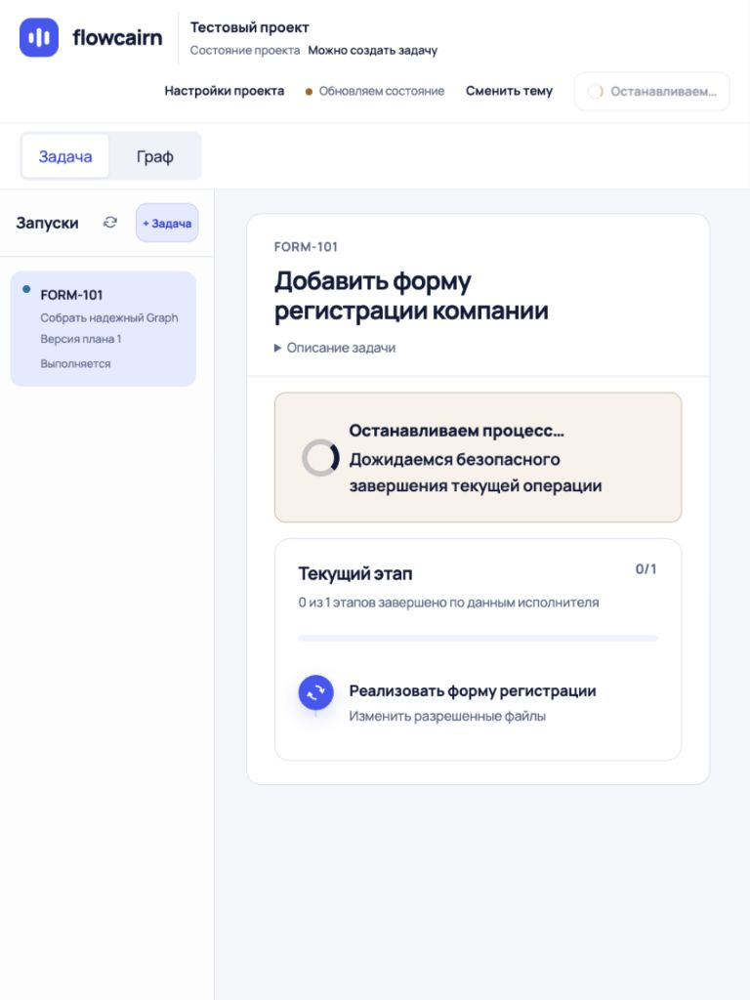
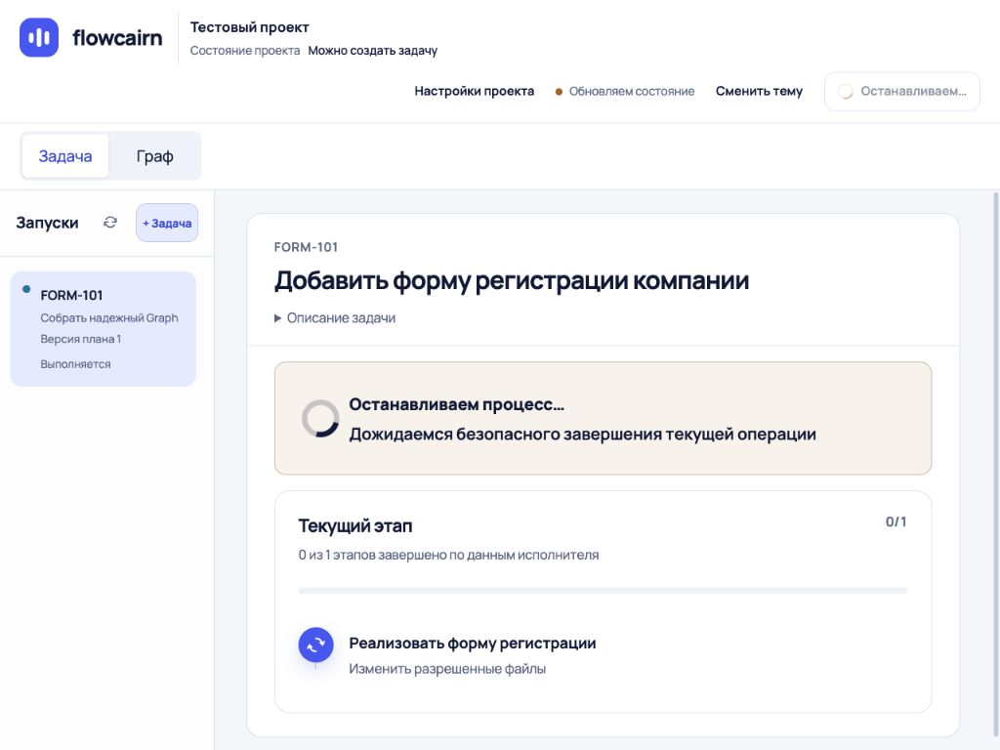
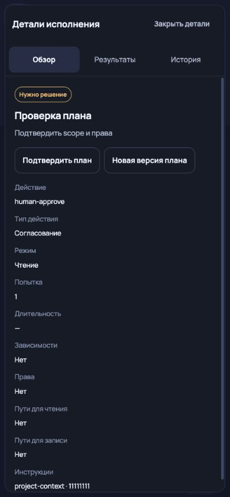

# Повторная проверка в браузере Codex

Выполненный этап P0 повторно проверен через Computer Use. Найдены и исправлены два дополнительных дефекта. После исправлений в перечисленных ниже сценариях визуальных поломок не обнаружено.

## Найдено и исправлено

1. На desktop закрытие боковых деталей оставляло клавиатурный фокус на body. Теперь фокус возвращается на «Детали исполнения», Enter снова открывает панель. Проверено вручную и новым регрессионным тестом.
2. На 768 px служебные кнопки сжимали имя проекта до короткого обрезанного фрагмента. На ширине 721–1179 px кнопки вынесены в отдельную строку, имя и состояние проекта остаются рядом с брендом. Проверено вручную на 768/1024 px и двумя регрессионными тестами.

## Матрица ручной проверки

| Шаг | Проверено | Результат |
|---|---|---|
| 1 | Задача на 1366×768 и 320×800 | Название, текущий этап и навигация читаются; горизонтального переполнения нет |
| 2 | Граф, «Весь граф», вкладки «Обзор / Результаты / История» | Переключения работают; пустой вкладки «План» у autonomous нет |
| 3 | Закрытие деталей и обновление snapshot | Панель остается закрытой; после исправления desktop-фокус возвращается |
| 4 | Состояние проекта → Настройки → Escape | Диалоги открываются, закрываются и сохраняют контекст задачи |
| 5 | Создание второй задачи на 390×844 | Поля заполняются, кнопка активируется, отмена возвращает фокус к списку |
| 6 | Подтвержденный результат и stale на 1366×768 | Подтверждение снимается при stale; причина и переход к отчетам видны |
| 7 | Остановка на 768×1024 и 1024×768 | Сообщение видно; шапка после исправления не сжимает проект |
| 8 | Неподтвержденная остановка на 390×844 | Отдельное предупреждение; recovery доступен согласно тестовой capability |
| 9 | Согласование на 390×844, светлая и темная темы | Основная кнопка видна на первом экране; текст и границы читаемы |
| 10 | Мобильные детали в темной теме | Вкладки не обрезаны; переключение стрелкой, Escape и возврат фокуса работают |

В консоли проверенной вкладки не обнаружены error/warn. На финальном мобильном диалоге DOM-проверка подтвердила отсутствие горизонтального overflow, закрытие dialog и возврат фокуса к инициатору.

## Финальные проверки кода

- UI: **113 passed, 1 skipped**. Пропущен smoke реального сервера без FLOWCAIRN_TEST_URL.
- Unit/integration viewer: **11 passed**.
- Viewer typecheck, ESLint, сборка и git diff --check: успешно.
- Три новых регрессионных сценария покрывают найденные проблемы: desktop-фокус и ширины 768/1024.

## Границы вывода

Это проверка текущего frontend на синтетическом API тестового стенда. Реальная AI-операция и остановка дочернего процесса не выполнялись. Ввод новой задачи проверен до готовности к отправке и через отмену; выполнение задачи не запускалось. Темная тема проверена на мобильном, светлая — на пяти перечисленных ширинах; это не полный перебор всех браузеров, устройств и сочетаний состояния.

Старые даты, разница goal/title и английские fixture-артефакты не считаются дефектами реальных данных. Надпись «Обновляем состояние» связана с завершающимся тестовым SSE, а не подтвержденным сбоем live-связи.

**100% всего исходного аудита не закрыто:** остаются запланированные P1/P2 — читаемый receipt, упрощение доказательств/ресурсов/технических полей, номер задачи и список запусков. Повторная проверка подтверждает выполненный объем P0 и связанные исправления, не заменяет эти работы.

## Свежие снимки

[Все 15 снимков](recheck/GALLERY.md). Снимок 09 фиксирует дефект до исправления; 11 и 12 — после.

