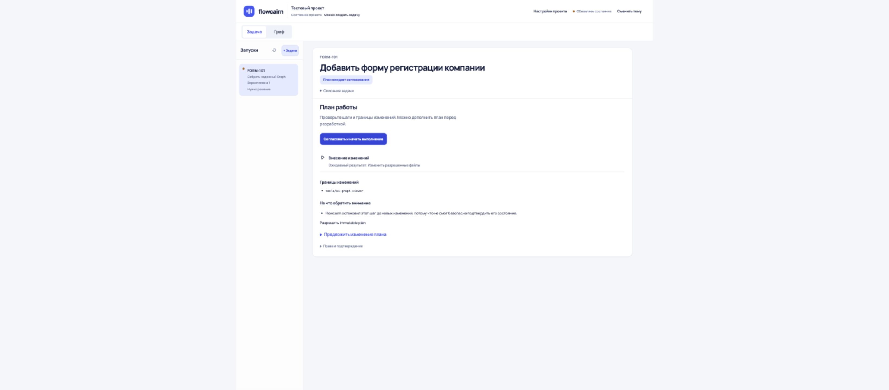
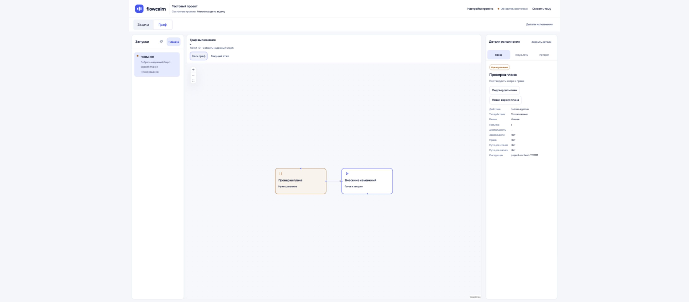
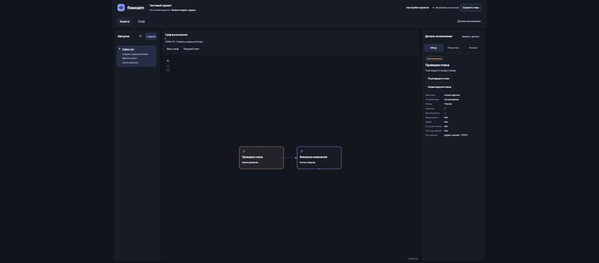
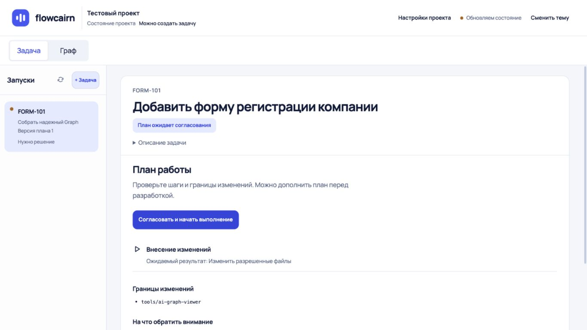
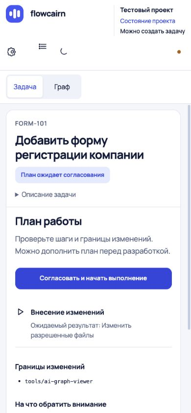

# Адаптация больших экранов выполнена

Рабочие элементы собраны в общую центрированную область. Свободное пространство остается снаружи; список задач больше не отделен от контента огромным промежутком.

## Изменения

Правила включаются при ширине области браузера от 1800 CSS px:

- Задача, создание и начальная загрузка: общая область до 1536 px.
- Граф: область до 2048 px, чтобы оставить место для структуры и деталей.
- Шапка, навигация и сообщения выровнены с границами той же области.
- Карточка задачи сохраняет ширину до 1180 px; от списка запусков до нее 32 px.
- При переключении в граф вся группа расширяется симметрично; вертикальная позиция навигации сохраняется.
- Ниже 1800 px действуют прежние правила ноутбука, планшета и мобильной версии.

Изменение ограничено компоновкой. Действия, права, данные и определение готовности не менялись. Новые декоративные элементы не добавлялись.

## Измерения в браузере Codex

Фактическая область страницы — 3277×1440 CSS px (ограничение browser override при DPR 1.25).

| Параметр | До | После |
|---|---:|---:|
| Разрыв между списком и карточкой | 920 px | 32 px |
| Ширина карточки задачи | 1180 px | 1180 px |
| Общая область задачи | Вся ширина страницы | 1536 px |
| Общая область графа | Вся ширина страницы | 2048 px |

Свободный canvas вокруг короткого графа остается намеренно: масштаб и читаемость узлов не меняются ради заполнения площади.

## Проверки

- 31 связанный UI-тест passed: ultrawide, layout и orientation.
- В составе набора добавлено 6 сценариев: 1920/2560/3440/3840 px, стабильная первоначальная загрузка и переход с ultra-wide к 1366/1024/390 px.
- 11 unit/integration viewer passed.
- Typecheck viewer, ESLint новых тестов, build, diff --check — успешно.
- Impeccable detector CSS: замечаний нет.
- Ручной обход в Codex: задача; граф с деталями и «Весь граф»; светлая/темная тема; возврат к 1366×768 и 390×844. В просмотренных состояниях переполнений не обнаружено.

Проверка UI использует синтетический API из fixtures. Реальное AI-исполнение не запускалось. Физическое разрешение монитора может отличаться от CSS-ширины из-за масштабирования системы и браузера.

## Свежие снимки

Исходное сравнение сохранено в [оценке до исправления](ULTRAWIDE.md).
