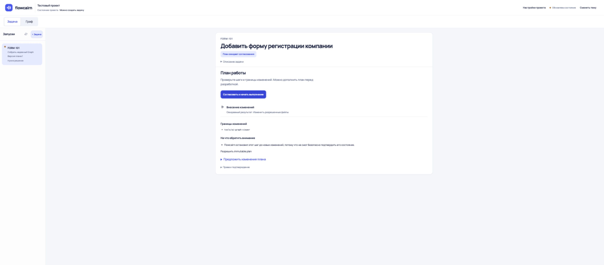
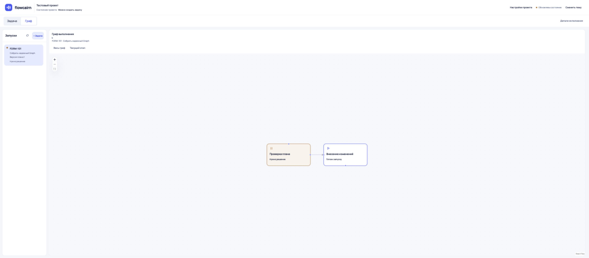
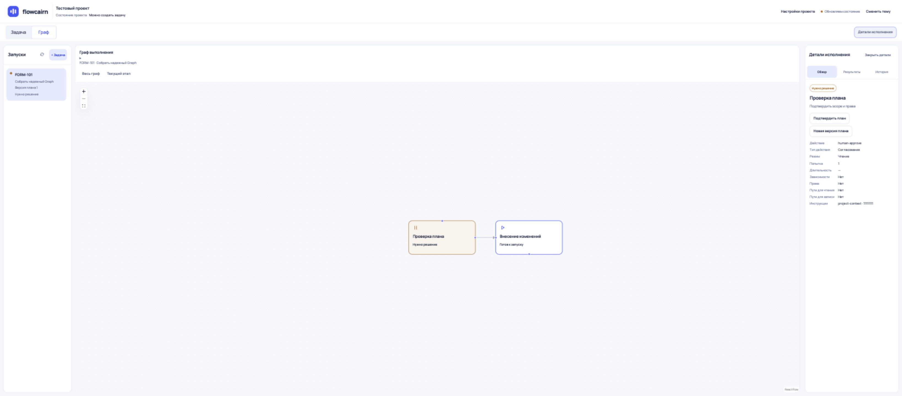
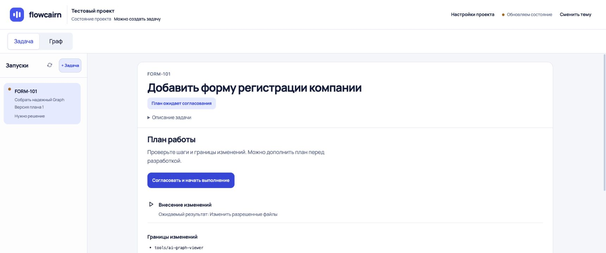

# Оценка ультраширокого экрана

На очень широкой области браузера композиция пока чрезмерно разрежена. Шума мало, но рабочие элементы слишком далеко друг от друга.

Проверка выполнена в браузере Codex на текущей сборке, без изменений исходников. Запрошенный override 3440×1440 был ограничен браузером: фактический innerWidth — 3277 CSS px, innerHeight — 1440. Дополнительно проверены 1720×720 CSS px. Это размеры области страницы, не физическое разрешение монитора; системное масштабирование и zoom меняют их соотношение.

| Шаг | Результат |
|---|---|
| 1. Задача, 3277×1440 | Карточка 1180 px центрируется в области шириной 3029 px. От правого края rail до нее 920 px пустоты |
| 2. Граф, 3277×1440 | Для короткого плана из двух узлов очень много пустого canvas. Большой граф может использовать пространство лучше — это не проверялось в этом ручном обходе |
| 3. Граф и детали | Детали закреплены у правого края; зрительно далеко от самих узлов и навигации |
| 4. Задача, 1720×720 | Карточка остается 1180 px, разрыв с rail снижается до 142 px. Композиция существенно собраннее |

## Что изменить

- Общая центрированная рабочая сетка: список задач, контент и детали должны оставаться рядом. Для обычного экрана задачи ориентир общей ширины 1500–1600 px; для графа с деталями — примерно 1900–2100 px. Это рекомендации для следующего этапа, не проверенный новый макет.
- Карточку текста сохранить в пределах 1000–1180 px. Между списком и контентом целиться в 24–32 px; свободное пространство оставлять за пределами всей группы.
- Строку «Задача / Граф», действия и детали привязать к той же сетке. Сейчас они распределены по всей ширине монитора.
- Графу оставить возможность использовать больше площади по необходимости. Пустота вокруг двух узлов сама по себе не означает, что нужно растягивать узлы или добавлять информацию.

Следовательно, отсутствие переполнения и работа кнопок не равны гармоничной адаптации к ultra-wide. Для эффективной ширины свыше 3000 CSS px нужен отдельный композиционный проход.

## Свежие снимки

