# Свежий повторный обход

Нумерация соответствует порядку обхода. 09 — до исправления планшетной шапки; 11–15 — финальная визуальная проверка. Данные синтетические.

## 01-task-desktop

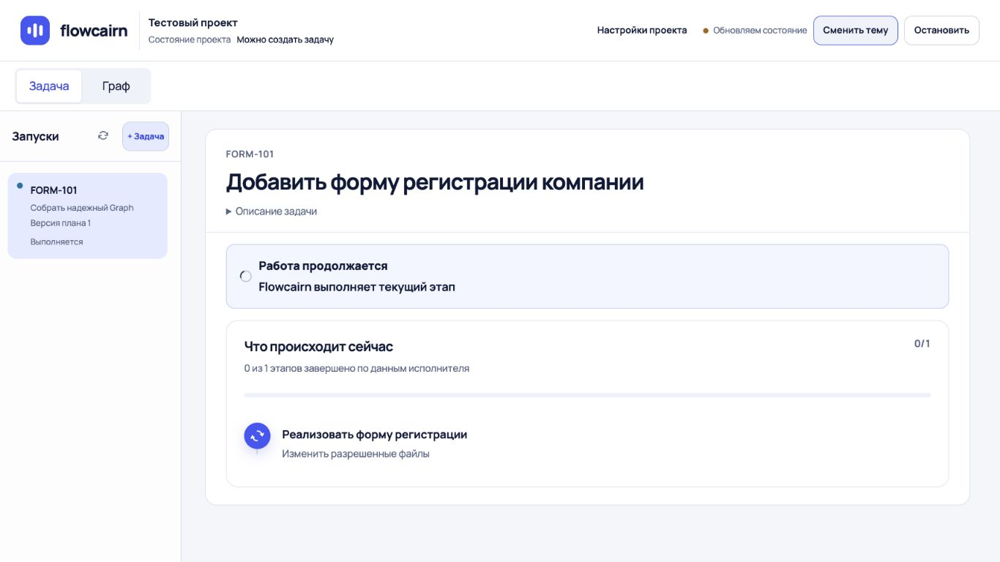

## 02-details-desktop

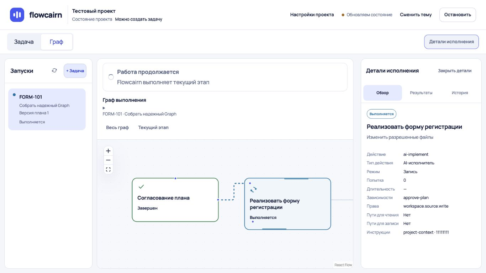

## 03-project-desktop

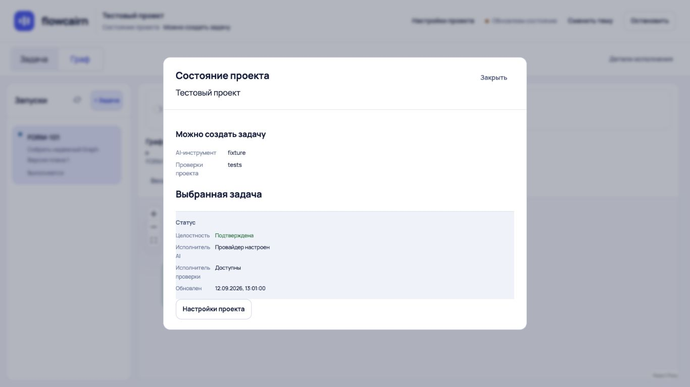

## 04-settings-desktop

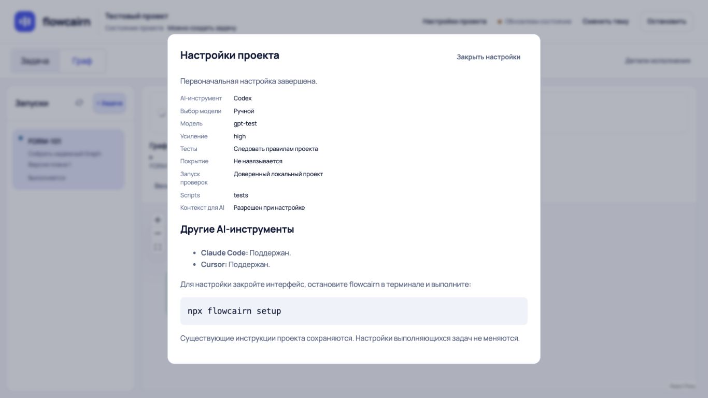

## 05-task-320

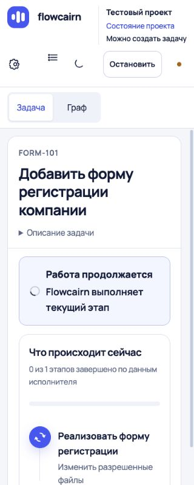

## 06-new-task-mobile

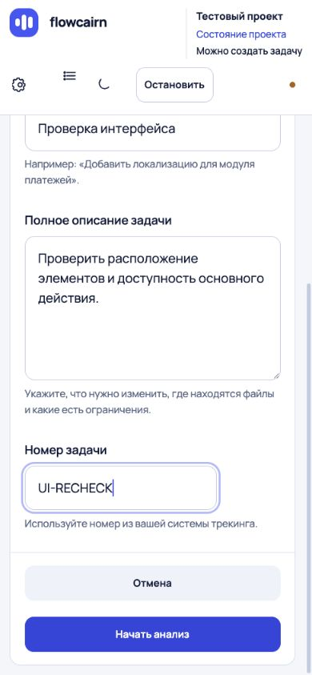

## 07-proven-desktop

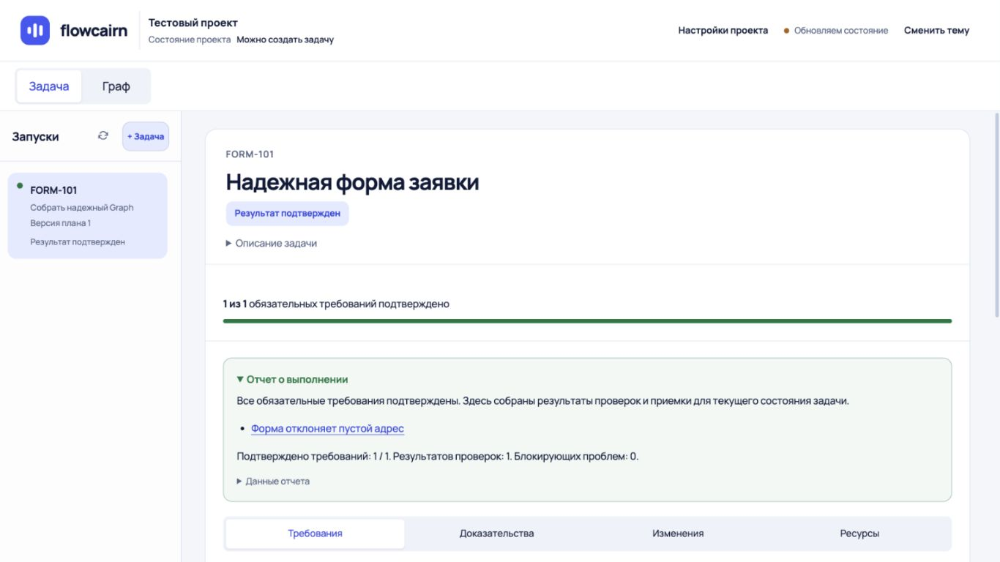

## 08-stale-desktop

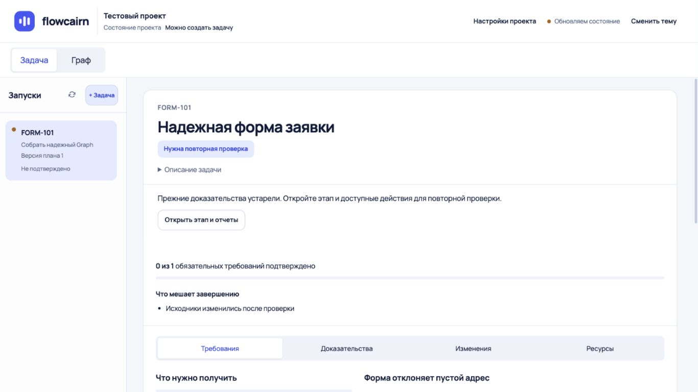

## 09-stopping-tablet

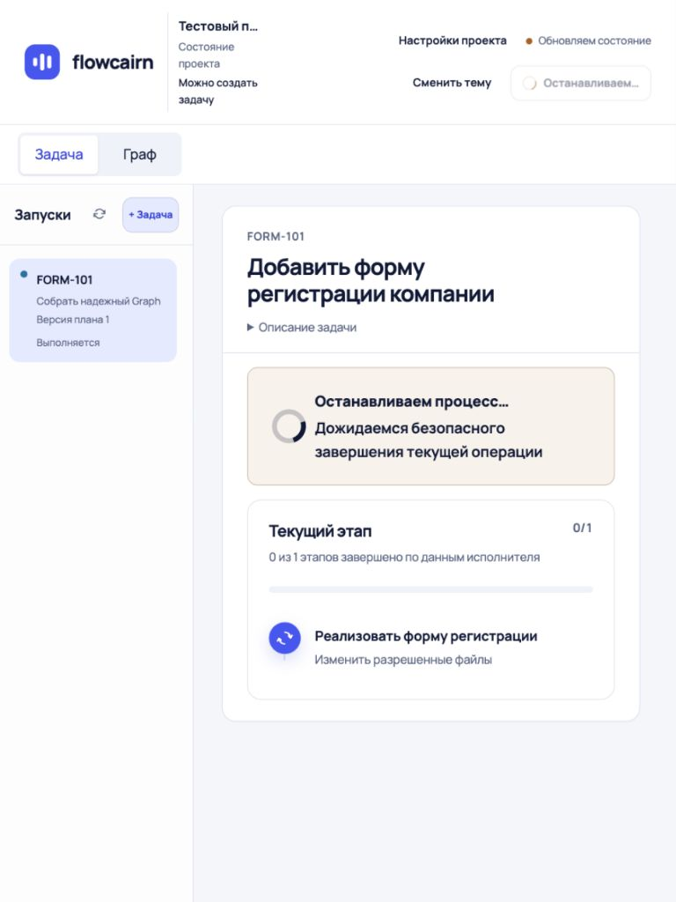

## 10-uncertain-mobile

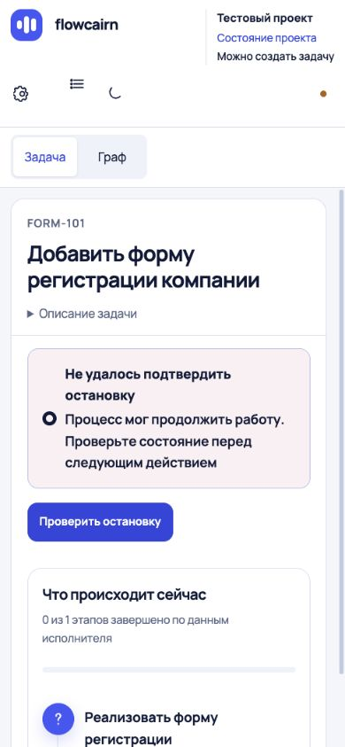

## 11-tablet-fixed

## 12-tablet-1024

## 13-plan-mobile

## 14-dark-mobile

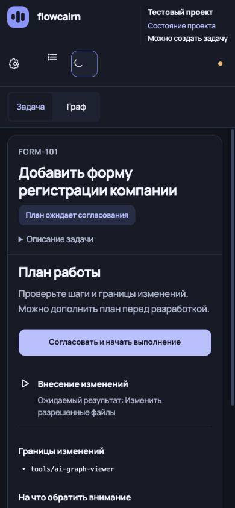

## 15-dark-details-mobile

