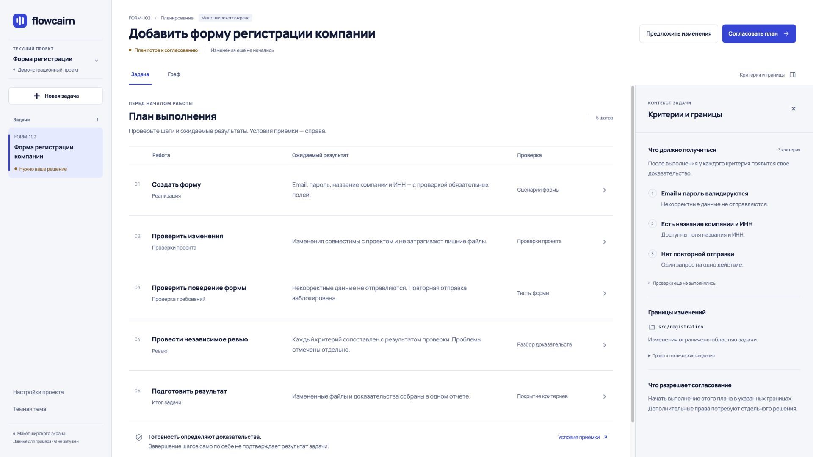
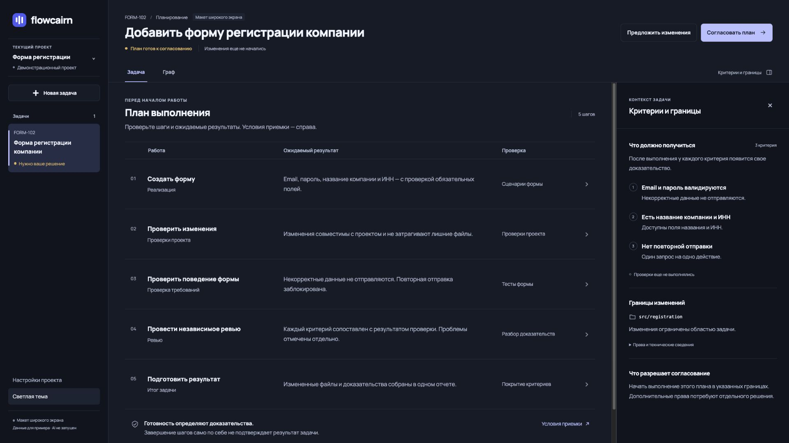
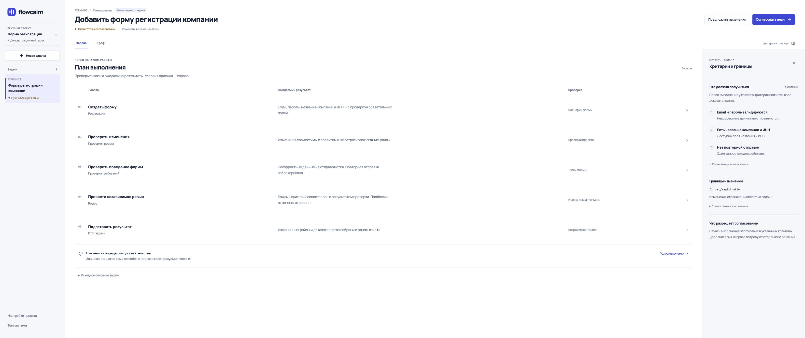

# Макет широкой компоновки Flowcairn

Отдельный интерактивный прототип экрана согласования плана. Основной viewer не подключен к этому макету и не изменялся в рамках этой задачи.

## Подтвержденные границы

- Дорабатывается только направление для широких мониторов.
- Текущий дизайн обычных экранов, ноутбуков и мобильных сохраняется.
- При будущей интеграции новая композиция должна включаться отдельно при достаточной ширине окна. Компактное отображение этого прототипа нужно для просмотра макета в небольшой панели Codex; оно не заменяет существующий мобильный UI.
- Палитра и Manrope взяты из текущего интерфейса.
- Демонстрационная задача основана на FORM-102 из UI-тестов проекта. Тексты ожидаемых результатов служат примером компоновки, не являются живыми доказательствами.

## Что можно посмотреть

- Общий план в центре: работа, ожидаемый результат и способ проверки.
- Критерии и границы справа.
- Нажатие на шаг заменяет правую панель его контекстом; возврат восстанавливает критерии задачи.
- Переключение «Задача / Граф», закрытие/раскрытие контекста, обе темы.
- Демонстрационные диалоги согласования и обратной связи. Ничего не запускают и не отправляют.

## Проверено в браузере Codex

- Обычный размер панели: 1024×576 CSS px.
- Широкий экран: 1920×1080 и 3277×1440 CSS px.
- Выбор шага, возврат к критериям, граф, диалог, Escape и возврат фокуса.
- В финальном макете рабочая область помещается по высоте; центр прокручивается самостоятельно. Найденное при первом просмотре обрезание нижней части исправлено.
- Светлая и темная темы при 1920 px; в консоли просмотренной вкладки error/warn не обнаружены.
- JavaScript и локальный preview-сервер прошли node --check.

Это проверенный макет, а не интеграция с executor. Новый дизайн еще не переносился в основной UI.

## Просмотр

Отдельный сервер: http://127.0.0.1:4351/ (процесс preview.mjs).
Основной интерфейс текущей сессии остается на http://127.0.0.1:4340/.

