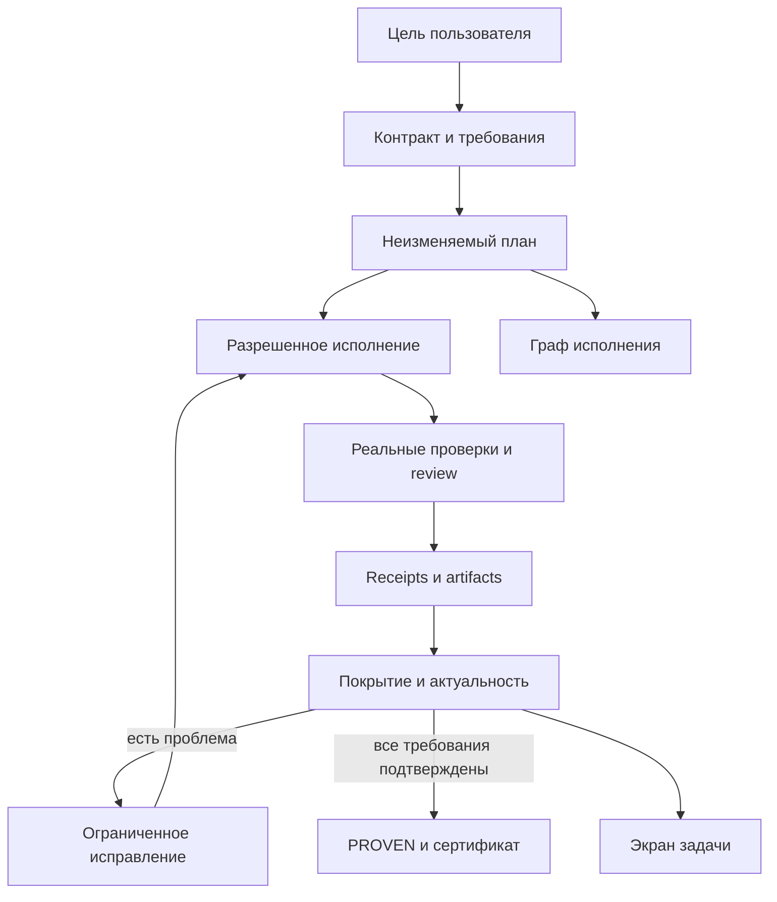

# Архитектура Flowcairn

Flowcairn сохраняет контракт задачи и выводит доказанность из реальных проверок. Executor владеет состоянием и разрешениями. UI получает snapshot и capabilities; граф остается представлением исполнения.

## Границы модулей

| Область | Ответственность |
| --- | --- |
| `task-contract.mjs`, `planning.mjs`, `validator.mjs` | Сохраняют исходные обязательства, связывают требования с работой и разрешенными verifiers, компилируют и проверяют план |
| `task-context.mjs`, `project-context-map.mjs`, `context-discovery.mjs` | Разрешают имена из естественной постановки, дают ограниченный индекс проекта и проверяют запросы дополнительного контекста до согласования реализации |
| `result-classification.mjs` | Отличает смысловую неопределенность завершенного AI-ответа от неподтвержденного процесса по immutable receipt |
| `service.mjs` | Единая управляющая граница: permissions, CAS/revision, idempotency, human challenges, согласование и допустимые переходы |
| `node-execution.mjs` | Одна зарегистрированная попытка: запуск, обработка результата, проверка границ, формирование receipts; запись проходит через fenced операции сервиса |
| `service-recovery.mjs`, `service-replan.mjs` | Подтверждение остановки, подготовка новой версии и восстановление отделены от управляющих проверок сервиса |
| `service-adapters.mjs` | Связывает проект, toolchain, файловый контекст и конкретных исполнителей; вычисляет runtime identity |
| `direct-adapters.mjs`, `direct-workspace.mjs`, `direct-binding.mjs`, `direct-source.mjs` | Прямая работа в текущем проекте с проверкой владельца, снимка и разрешенных путей; Git не требуется |
| `repair-decomposition.mjs`, `autonomy-policy.mjs`, `failure-reason.mjs` | Уменьшают слишком широкий шаг после тайм-аута, ограничивают срок по числу работ и сообщают безопасную причину ошибки |
| `runner.mjs`, `runner-ai-command.mjs`, `supervisor.mjs` | Подготовка ограниченных AI-команд отделена от supervision процесса и подтверждения его остановки |
| `bounded-context.mjs`, `usage.mjs` | Выбирают контекст по требованиям/зависимостям и нормализуют только реальные counters провайдера |
| `analysis-evidence.mjs`, `prompt-budget.mjs` | Выбирают актуальный завершенный анализ и ограничивают запрос, сохраняя обязательный контекст |
| `requirement-verification.mjs` | Проверяет цитаты по реальным байтам; нормализует failures требований; проверяет привязку ручной приемки |
| `task-proof.mjs` | Чистая проекция Requirements → Evidence → Conclusion; coverage, stale, findings, расход и deterministic certificate |
| `task-proof-service.mjs`, `task-snapshot.mjs` | Подключают доказательства к проверенному живому состоянию и создают read model для UI |
| `store.mjs`, `workspace.mjs`, `patch.mjs` | Durable local state, fingerprint файлов и безопасное применение изменений |
| `json-transfers.mjs`, `change-evidence.mjs`, `unified-diff.mjs` | Точный перенос ключей большого JSON и проверяемое описание изменений без передачи целого файла в review |
| `docker-checks.mjs`, `docker-stop-proof.mjs` | Исполнение контейнера отделено от хранения и проверки доказательств остановки |
| `orchestrator-*.mjs` | Отдельные границы registry/locks, Git, Graph leases, delivery, integration, inspection и source bootstrap Orchestrator |
| `bin/installation.mjs`, `bin/project-files.mjs` | Установка и безопасные операции с проектом отделены от CLI dispatch |
| `AppFrame.tsx`, `TaskOverview.tsx`, `TaskCockpit.tsx`, `ResourcePanel.tsx` | Стабильный каркас, основной экран задачи, требования, evidence и ресурсы; семантика PROVEN не вычисляется в React |
| `ExecutionStatus.tsx`, `execution-presentation.ts`, `StatusLoader.tsx`, `TechnicalDetails.tsx` | Человекочитаемая проекция состояния исполнения, loaders и отделение пользовательского сообщения от диагностики |
| `ExecutionGraph.tsx`, `ExecutionDetails.tsx`, `ExecutionDialogs.tsx` | Расширенное представление графа, выбранного узла, immutable receipts и управляющих диалогов |

Модули выполняют конкретные обязанности; универсального plugin framework и второго хранилища состояния нет. Compiler, service и verifier используют один immutable contract. Разделение файлов не дает модулю новые права.

## Контракт, evidence и вывод

`GraphPlan.taskContract` содержит цель, hash исходного описания, требования, ограничения, предположения, неизвестные, scope и выбранную строгость. Requirement связывает `workIds` со способом проверки, критерием и путями. Его ID и смысл сохраняются при автоматическом repair.

Обычный `state.status=passed` относится к исполнению nodes. `snapshot.proof.status=PROVEN` требует полного покрытия обязательных требований актуальными доказательствами. Старый план без контракта остается историей; один green node, общий review pass или наличие diff не повышают его до PROVEN.

Checks создают receipts с реальным exit code, termination и input fingerprint. Review получает полный проверенный bundle implementation evidence и возвращает отдельные assessments. Runtime проверяет criterion, check IDs и совпадение цитат с файлами. Failed assessment не может быть скрыт общим `pass`: он становится failure и blocking finding для bounded repair.

Human acceptance хранится отдельным immutable receipt по одному требованию. Запрос связан с текущими plan/revision/challenge/result hash; только метод `human` допускает этот путь. Общая финальная приемка выполнения не подменяет приемку отдельного требования.

## Актуальность и восстановление

Snapshot проверяет живую рабочую копию и toolchain. Изменившиеся исходники делают прежние доказательства stale. Ошибка чтения или integrity блокирует актуальное подтверждение. При потере связи UI скрывает прежний сертификат до успешного refresh.

Replan создает новую версию; предыдущие receipts остаются доступны. Исправление сохраняет контракт, права и разрешенный контекст чтения. Checks и review выполняются заново. Findings закрываются только более поздними связанными проверками. Автоматический цикл ограничен двумя исправлениями; срок плана определяется числом этапов и ограничен двумя часами. Неопределенная остановка процесса требует восстановления.

Durable state хранит `stopRequested` и связанный `stopResult`. `task-snapshot.mjs` проецирует их вместе с `activeOperation` в `Snapshot.execution`: `running`, `stopping`, `stopped`, `stop-uncertain` или `idle`. `stopped` выводится только после подтвержденного termination либо подтвержденной отмены до запуска дочернего процесса. Подтвержденная пользовательская остановка получает status/verdict `cancelled`; неподтвержденное завершение остается `uncertain` и требует recovery.

Store использует CAS, locks, durable revisions и fsync. Текущие требования, findings, evidence и следующая допустимая работа восстанавливаются из сохраненных объектов, а не из чата модели. Это локальное файловое хранилище, не распределенная очередь.

## Источники, контекст и безопасность

`runtimeRoot` — пакет Flowcairn; `projectRoot` — проект пользователя. Runtime не копирует свои исходники в пользовательский проект. В режиме `direct` изменения применяются в текущем `projectRoot`, в явно выбранном режиме `worktree` — в отдельной Git-копии. Оба режима ограничены утвержденными путями и правами.

Для реализации compiler использует paths текущего шага, explicit readPaths, необходимые зависимости и проектные инструкции. Полный review bundle имеет отдельный предел 512 KiB и не обрезается молча. Провайдеры получают структурированные данные, а executable actions выбирает registry.

Для нового локального проекта default — `trusted-local`: runtime регистрирует только найденные conventional scripts и связывает их точные имена и команды hash локальной установки. Изменившиеся scripts не запускаются до повторного `setup`. `none` и `hardened` остаются явными настройками. Произвольные команды из model/task JSON не исполняются. Внешние side effects, commit, push и deploy не следуют из PROVEN.

Фундаментальные сущности — Task, Requirement, Work, Artifact, Evidence, Finding и Result. Полноценный текущий executor работает с software development; поддержка других доменов требует собственных действий и verifiers, а не нового значения зеленого статуса. [Подробные ограничения](LIMITATIONS.md).
