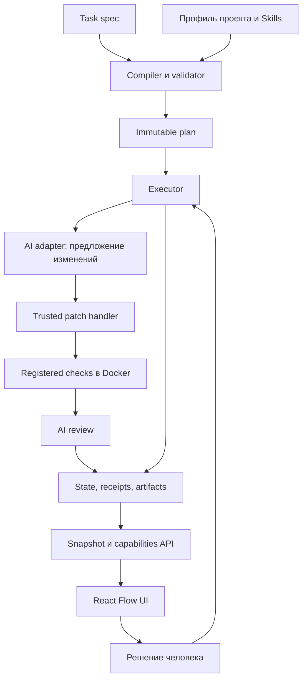

# Как устроен Flowcairn

**Executor управляет работой. React Flow показывает состояние и передает разрешенные запросы.** CLI и HTTP обращаются к одному domain service, поэтому смена интерфейса не меняет правила выполнения.

## Один пакет, несколько проектов

`runtimeRoot` — установленный Flowcairn. `projectRoot` — выбранный репозиторий пользователя. Профиль принадлежит проекту; исходники runtime не копируются в его source tree. Рабочие попытки получают отдельные worktrees и контролируемое владение ресурсами.

## План и результат

Compiler создает baseline с approval, анализом, implementation, checks, review и acceptance. Validator проверяет DAG, разрешенные actions, права, Skills, scope, зависимости и обязательные gates.

План конкретного run неизменяем. Replan создает новую версию и новую связь с исходными данными; старое evidence остается историей. Предложенные AI шаги не означают, что они автоматически стали отдельными исполняемыми nodes.

## Кто может менять файлы

AI возвращает структурированные edits. Trusted patch handler проверяет разрешенные пути, исходный hash и владение попыткой, прежде чем применить изменения. Анализ и review не являются writers исходников.

Checks выполняются отдельным Docker-адаптером с зарегистрированными командами. Runtime не берет shell-команду из task JSON. Контейнеры не получают произвольный доступ к хосту и не заменяются host shell при сбое подготовки.

## Что сохраняется

Локальное состояние содержит планы, попытки, решения, hashes, результаты проверок и artifacts. Запись использует CAS, lock, цепочку revisions и fsync; pointer публикуется после durable revision. Это локальное файловое хранилище, не распределенная очередь.

Raw stdout, stderr, prompts и credentials не нужны для красивого статуса. Сохраняемые artifacts при этом могут содержать diff вашего кода: исключение state из Git не делает его публичным. Обращайтесь с ним как с данными проекта.

## Review

Review — отдельный AI-вызов с отдельной ролью. Он получает полный проверенный bundle implementation evidence, привязанный к task/plan/snapshot. Bundle ограничен **512 KiB**: при превышении требуется меньшая задача, а не тихое обрезание diff.

Ответ подтверждает hash предоставленного evidence. Это проверка связи данных; она не доказывает, что модель внимательно прочла каждый фрагмент или нашла все ошибки. `skillsUsed` также остается self-report. Итоговая оценка включает checks, diff и решение человека.

## Остановка и повтор

- `failed` — известная неудача; retry разрешается лишь для зарегистрированной безопасной операции и неизмененного workspace.
- `uncertain` — неизвестен результат или остановка; требуется recovery, затем новый план.
- `stale` — изменились связанные исходные данные или правила; старые разрешения не продолжают действовать автоматически.

[Стандарт](GRAPH-REACTFLOW-STANDARD.md) описывает более широкий целевой набор свойств. [Ограничения релиза](LIMITATIONS.md) отделяют его от текущего baseline.
