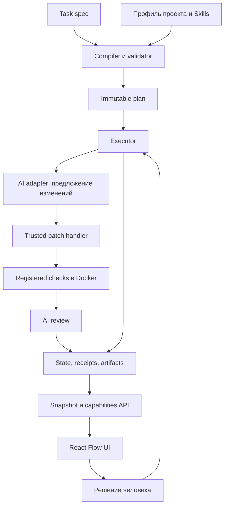

# Как устроен Flowcairn

**Executor управляет работой. React Flow показывает состояние и передает разрешенные запросы.** CLI и HTTP обращаются к одному domain service, поэтому смена интерфейса не меняет правила выполнения.

## Один пакет, несколько проектов

`runtimeRoot` — установленный Flowcairn. `projectRoot` — выбранный репозиторий пользователя. Профиль принадлежит проекту; исходники runtime не копируются в его source tree. Рабочие попытки получают отдельные worktrees и контролируемое владение ресурсами.

## План и результат

UI передает заголовок, описание и номер задачи в общий intake. Разрешение чтения задается при первоначальной настройке и связано с локальной установкой. Первый AI-этап сохраняет структурированный анализ, второй предлагает от 1 до 12 шагов: результат, пути и зависимости. Trusted compiler превращает их в исполняемые узлы и добавляет обязательные gates, проверки и ревью. Validator проверяет DAG, разрешенные actions, права, Skills, scope и зависимости.

План конкретного run неизменяем. Replan создает новую версию и новую связь с исходными данными; старое evidence остается историей. Предложенные AI шаги становятся исполняемыми узлами только после проверки compiler/validator. До согласования человек может уточнить требования: анализ и история сохраняются, план получает новую версию. Одно согласование запускает разрешенную разработку и ограниченный цикл исправлений. Действия, разрешения и проверки назначает runtime; модель их не выбирает.

## Кто может менять файлы

AI возвращает структурированные edits. Trusted patch handler проверяет разрешенные пути, исходный hash и владение попыткой, прежде чем применить изменения. Анализ и review не являются writers исходников.

Checks выполняются отдельным Docker-адаптером с зарегистрированными командами. Runtime не берет shell-команду из task JSON. Контейнеры не получают произвольный доступ к хосту и не заменяются host shell при сбое подготовки.

## Что сохраняется

Локальное состояние содержит планы, попытки, решения, hashes, результаты проверок и artifacts. Запись использует CAS, lock, цепочку revisions и fsync; pointer публикуется после durable revision. Это локальное файловое хранилище, не распределенная очередь.

Raw stdout, stderr, prompts и credentials не нужны для красивого статуса. Сохраняемые artifacts при этом могут содержать diff вашего кода: исключение state из Git не делает его публичным. Обращайтесь с ним как с данными проекта.

## Review

Review — отдельный AI-вызов с отдельной ролью. Он получает полный проверенный bundle implementation evidence, привязанный к task/plan/snapshot. Bundle ограничен **512 KiB**: при превышении требуется меньшая задача, а не тихое обрезание diff.

Ответ подтверждает hash предоставленного evidence. Это проверка связи данных; она не доказывает, что модель внимательно прочла каждый фрагмент или нашла все ошибки. `skillsUsed` также остается self-report. Итоговая оценка включает checks, diff и решение человека.

## Остановка и повтор

- `failed` — известная неудача; retry разрешается лишь для зарегистрированной безопасной операции и неизмененного workspace.
- `uncertain` — неизвестен результат или остановка; требуется recovery, затем новый план.
- `stale` — изменились связанные исходные данные или правила; старые разрешения не продолжают действовать автоматически.

[Стандарт](GRAPH-REACTFLOW-STANDARD.md) описывает более широкий целевой набор свойств. [Ограничения релиза](LIMITATIONS.md) отделяют его от текущего baseline.

Последовательный план в ReactFlow по умолчанию свернут в ряды по три этапа; стрелки показывают порядок переходов. Развилки и объединения показаны сверху вниз. Раскладка зависит только от связей, а не от статусов выполнения. На широком экране сначала виден весь граф, на телефоне — читаемый текущий этап; ручное приближение сохраняется при обновлениях. Длинное название сокращается только на карточке и полностью доступно в деталях.

## Skills и правила проекта

Core/domain Skills остаются в пакете. Project Skills подключаются на месте по явному выбору, области действия и этапам. Runtime закрепляет исходный текст и эффективные инструкции хешами, передает их AI и проверяет неизменность. [Правила выбора и тестирования](SKILLS.md).

Обнаружение AGENTS/CLAUDE/других инструкций отделено от передачи содержимого AI и от managed-активации. Изменения правил делают связанный план устаревшим. Интеграция не может изменить штатную иерархию инструкций внешнего клиента.

## Жизненный цикл установки

Viewer и runtime удерживают локальные lease-записи. Uninstall проверяет отсутствие активных операций и защищает проверку общим барьером от нового запуска. Он сохраняет пользовательские результаты, worktrees и измененные файлы. Это кооперативная защита на локальной файловой системе, не изоляция от администратора или вредоносного процесса того же пользователя.

## Продуктовый сценарий

Прогресс одной задачи может охватывать несколько неизменяемых версий плана. UI следует связи преемников, сохраняя контекст анализа и планирования. Служебный идентификатор запуска не заменяет номер задачи пользователя.

Автономное исправление разрешено только политикой согласованного плана: те же файлы, права и обязательные проверки, ограниченное число циклов и время. Runtime сохраняет происхождение такого разрешения отдельным evidence. Неопределенность не разрешает автоматический повтор записи.

Финальное `ready-for-review` означает, что реализация и предусмотренные проверки завершены. Это не человеческая приемка и не разрешение на commit или PR. Старый управляемый профиль с отдельными gates остается читаемым и не получает новых полномочий автоматически.

История ручного перепланирования отделена от лимита автоматических исправлений: в review допускается до 20 прошлых execution-версий при общем лимите полного evidence 512 KiB. Обрезать diff нельзя. После обновления runtime старые receipts сверяются со своим immutable планом; новый запуск проверяется по текущему runtime и требует нового согласования. Это не разрешает исполнять старый код или расширять права.
