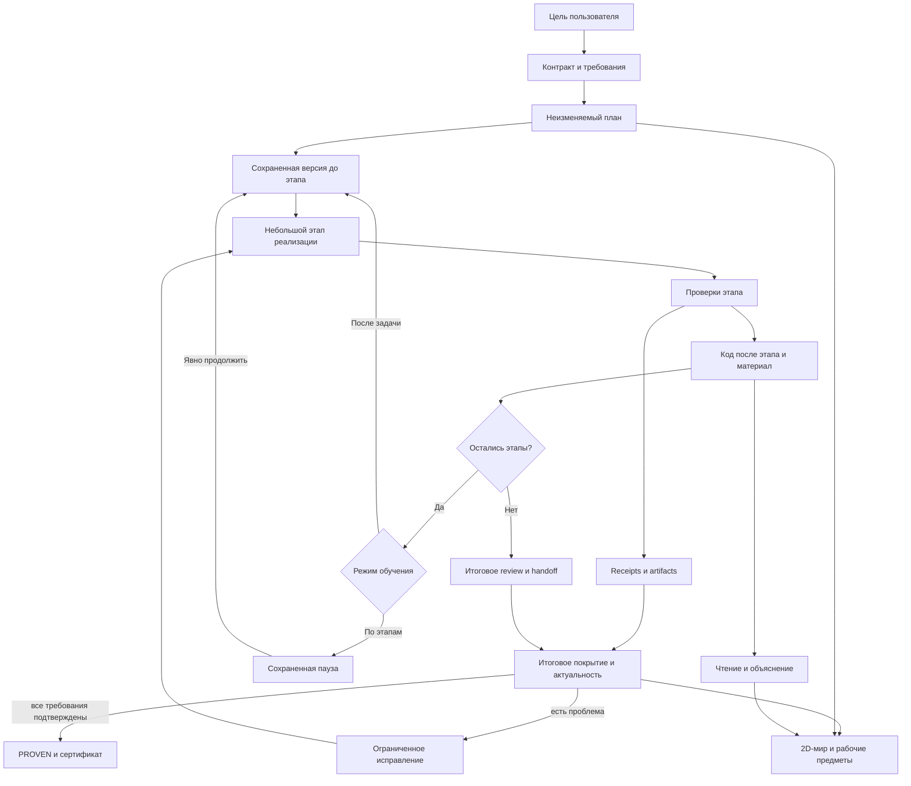

# Архитектура Flowcairn

В Flowcairn три отдельные части: исполнение задачи, учебный материал и 2D-интерфейс. Executor владеет графом, состоянием, разрешениями и выводом о результате. Обучение использует сохраненные версии исходников. Мир получает snapshot и capabilities; персонаж, книга и навигация не управляют исполнением самостоятельно.

```mermaid
flowchart TD
  Goal[Цель пользователя] --> Contract[Контракт и требования]
  Contract --> Plan[Неизменяемый план]
  Plan --> Before[Сохраненная версия до этапа]
  Before --> Execution[Небольшой этап реализации]
  Execution --> Verification[Проверки этапа]
  Verification --> Evidence[Receipts и artifacts]
  Evidence --> Proof[Итоговое покрытие и актуальность]
  Proof -->|есть проблема| Repair[Ограниченное исправление]
  Repair --> Execution
  Proof -->|все требования подтверждены| Proven[PROVEN и сертификат]
  Verification --> Material[Код после этапа и материал]
  Material --> More{Остались этапы?}
  More -->|Да| Hold{Режим обучения}
  More -->|Нет| Review[Итоговое review и handoff]
  Review --> Proof
  Hold -->|По этапам| Pause[Сохраненная пауза]
  Pause -->|Явно продолжить| Before
  Hold -->|После задачи| Before
  Material --> Learning[Чтение и объяснение]
  Proof --> World[2D-мир и рабочие предметы]
  Plan --> World
  Learning --> World
```

## Границы модулей

| Область | Ответственность |
| --- | --- |
| `stage-plan.mjs`, `stage-execution.mjs` | Компилируют проверяемые этапы; сохраняют before до эффекта, связывают receipt, after и учебную паузу |
| `check-profile.mjs`, `check-toolchain.mjs`, `check-command.mjs`, `check-execution.mjs`, `check-shell.mjs` | Регистрируют команды любого стека, отличают путь вызова от identity инструмента, повторно проверяют фактические входы перед запуском |
| `learning-sources.mjs`, `learning-material.mjs`, `lesson-validation.mjs` | Хранят выбранные полные bytes, проверяют привязку материала и точные цитаты; не повышают PROVEN |
| `learning-control.mjs`, `learning-view.mjs` | Управляют явным Continue/режимом/учебной отметкой и дают read-only проекцию текущих и исторических материалов |
| `learning-jobs.mjs`, `learning-job-state.mjs`, `learning-job-adapter.mjs` | Используют тот же store/CAS/supervisor для ограниченных учебных вызовов; поздний ответ меняет только учебную ветку |
| `learning-prompt.mjs`, `learning-provider.mjs`, `learning-runner.mjs` | Готовят только сохраненный материал, проверяют ограничения выбранного CLI, результат и безопасную очистку |
| `src/rpg/**`, `src/learning/**` | Отображают мир, игровые поверхности и источник/объяснение; используют существующий клиентский controller |
| `task-contract.mjs`, `planning.mjs`, `validator.mjs` | Сохраняют исходные обязательства, связывают требования с работой и разрешенными verifiers, компилируют и проверяют план |
| `task-context.mjs`, `project-context-map.mjs`, `context-discovery.mjs` | Разрешают имена из естественной постановки, дают ограниченный индекс проекта и проверяют запросы дополнительного контекста до согласования реализации |
| `result-classification.mjs` | Отличает смысловую неопределенность завершенного AI-ответа от неподтвержденного процесса по immutable receipt |
| `service.mjs` | Единая управляющая граница: permissions, CAS/revision, idempotency, human challenges, согласование и допустимые переходы |
| `node-execution.mjs` | Одна зарегистрированная попытка: запуск, обработка результата, проверка границ, формирование receipts; запись проходит через fenced операции сервиса |
| `service-recovery.mjs`, `service-replan.mjs` | Подтверждение остановки, подготовка новой версии и восстановление отделены от управляющих проверок сервиса |
| `service-adapters.mjs` | Связывает проект, toolchain, файловый контекст и конкретных исполнителей; вычисляет runtime identity |
| `direct-adapters.mjs`, `direct-workspace.mjs`, `direct-binding.mjs`, `direct-source.mjs` | Прямая работа в текущем проекте с проверкой владельца, снимка и разрешенных путей; Git не требуется |
| `repair-decomposition.mjs`, `autonomy-policy.mjs`, `failure-reason.mjs` | Уменьшают слишком широкий шаг после тайм-аута, ограничивают срок по числу работ и сообщают безопасную причину ошибки |
| `runner.mjs`, `runner-ai-command.mjs`, `supervisor.mjs` | Подготовка ограниченных AI-команд отделена от supervision процесса и подтверждения его остановки |
| `bounded-context.mjs`, `usage.mjs` | Выбирают контекст по требованиям/зависимостям и нормализуют только реальные counters провайдера |
| `analysis-evidence.mjs`, `prompt-budget.mjs` | Выбирают актуальный завершенный анализ и ограничивают запрос, сохраняя обязательный контекст |
| `requirement-verification.mjs` | Проверяет цитаты по реальным байтам; нормализует failures требований; проверяет привязку ручной приемки |
| `task-proof.mjs` | Чистая проекция Requirements → Evidence → Conclusion; coverage, stale, findings, расход и deterministic certificate |
| `task-proof-service.mjs`, `task-snapshot.mjs` | Подключают доказательства к проверенному живому состоянию и создают read model для UI |
| `store.mjs`, `workspace.mjs`, `patch.mjs` | Durable local state, fingerprint файлов и безопасное применение изменений |
| `json-transfers.mjs`, `change-evidence.mjs`, `unified-diff.mjs` | Точный перенос ключей большого JSON и проверяемое описание изменений без передачи целого файла в review |
| `runner.mjs`, `supervisor.mjs` | Локальные проверки в рабочем каталоге проекта, ограничение времени и подтверждение остановки |
| `docker-checks.mjs`, `docker-stop-proof.mjs` | Legacy код для восстановления старых контейнерных receipts; новые checks сюда не направляются |
| `orchestrator-*.mjs` | Отдельные границы registry/locks, Git, Graph leases, delivery, integration, inspection и source bootstrap Orchestrator |
| `bin/installation.mjs`, `bin/project-files.mjs` | Установка и безопасные операции с проектом отделены от CLI dispatch |
| `App.tsx`, `use-workflow-controller.tsx`, `WorkflowDialogs.tsx` | Общий контроллер чтения и явных команд, неизменные envelopes, gate/evidence dialogs; игровая навигация не создает второй executor |
| `rpg/RpgShell.tsx`, `WorldCanvas.tsx`, `world-scene.ts` | 2D-мир, перемещение и входы в игровые предметы; только представление snapshot/capabilities |
| `rpg/DiagnosticBook.tsx`, `DiagnosticNodes.tsx`, `ExecutionDetails.tsx` | Выбор этапа, разрешенные действия, требования, receipts, история и сравнение планов без ReactFlow |
| `TaskOverview.tsx`, `TaskCockpit.tsx`, `ResourcePanel.tsx`, `task-presentation.ts` | Переиспользуемые панели результата, evidence, ручной приемки и известных затрат; семантика PROVEN остается на сервере |
| `learning/LearningReader.tsx`, `SavedSourcePanel.tsx`, `LessonExplanation.tsx` | Сохраненный код, source-bound объяснение и границы полноты; чтение не запускает AI |
| `learning/content-command.ts`, `use-learning-job.ts`, `use-bound-read.ts` | Явные учебные команды, ограниченное чтение статуса, защита от поздних ответов и скрытие данных при отзыве доступа |
| `ExecutionStatus.tsx`, `execution-presentation.ts`, `StatusLoader.tsx`, `TechnicalDetails.tsx` | Подписи состояния исполнения, загрузки и причины ошибок |

Модули выполняют конкретные обязанности; универсального plugin framework и второго хранилища состояния нет. Compiler, service и verifier используют один immutable contract. Разделение файлов не дает модулю новые права. Новые планы и запуски используют V3, исторические V2 читаются без переписывания их объектов; старый исполнитель не продолжает V3.

## Исполнение и обучение

Каждый смысловой этап содержит реализацию, проверку области изменений и все обязательные зарегистрированные проверки. У последнего этапа сохраняется итоговое review/handoff. Промежуточные receipts остаются историческими; финальный PROVEN опирается на проверки итоговой версии, полное покрытие требований и отсутствие блокирующих замечаний.

В режиме `after-stage` граница проверенного промежуточного этапа атомарно фиксирует завершенный receipt, материал и `learning-hold`, если впереди есть следующий этап. После последнего этапа выполняется review/handoff и сохраняется итоговый материал без учебной паузы. Следующая реализация не запускается после чтения книги или перезапуска процесса. `continue-learning` снимает только конкретную паузу после повторной проверки текущих прав и версии. В `after-task` те же границы сохраняют материалы без пауз; итоговый материал собирается по финальным bytes.

Учебный вызов не является узлом реализации и не получает право применять patch. Его вход связан с material/method/provider и явной командой. GET не вызывает AI. Один активный вызов на запуск, конечные лимиты и отсутствие автоматического повторного inference после сбоя сохраняются отдельно от графа. Ошибка генерации не принимает и не отменяет выполненный код.

Полная source capture и обучение имеют разные границы: небезопасный или изменившийся выбранный исходник блокирует зависимый эффект; известные ограничения размера и исключения дают честный неполный материал. Историческое чтение использует сохраненные bytes и текущую политику доступа, а не подставляет live-файл под старое объяснение.

## Контракт, evidence и вывод

`GraphPlan.taskContract` содержит цель, hash исходного описания, требования, ограничения, предположения, неизвестные, scope и выбранную строгость. Requirement связывает `workIds` со способом проверки, критерием и путями. Его ID и смысл сохраняются при автоматическом repair.

Обычный `state.status=passed` относится к исполнению nodes. `snapshot.proof.status=PROVEN` требует полного покрытия обязательных требований актуальными доказательствами. Старый план без контракта остается историей; один green node, общий review pass или наличие diff не повышают его до PROVEN.

Checks создают receipts с реальным exit code, termination и input fingerprint. Review получает полный проверенный bundle implementation evidence и возвращает отдельные assessments. Runtime проверяет criterion, check IDs и совпадение цитат с файлами. Failed assessment не может быть скрыт общим `pass`: он становится failure и blocking finding для bounded repair.

Human acceptance хранится отдельным immutable receipt по одному требованию. Запрос связан с текущими plan/revision/challenge/result hash; только метод `human` допускает этот путь. Общая финальная приемка выполнения не подменяет приемку отдельного требования.

## Актуальность и восстановление

Snapshot проверяет живую рабочую копию и toolchain. Изменившиеся исходники делают прежние доказательства stale. Ошибка чтения или integrity блокирует актуальное подтверждение. При потере связи UI скрывает прежний сертификат до успешного refresh.

Обнаружение инструкций и Skills переиспользуется только внутри одной синхронной фазы чтения: построения/валидации плана или чтения списка запусков. Следующая фаза читает данные заново. Этот кеш не переносится через `await`, запись состояния или проверку fingerprint и не отменяет повторную проверку прав перед действием.

Replan создает новую версию; предыдущие receipts остаются доступны. Исправление сохраняет контракт, права и разрешенный контекст чтения. Checks и review выполняются заново. Findings закрываются только более поздними связанными проверками. Автоматический цикл ограничен двумя исправлениями; срок плана определяется числом этапов и ограничен двумя часами. Неопределенная остановка процесса требует восстановления.

Durable state хранит `stopRequested` и связанный `stopResult`. `task-snapshot.mjs` проецирует их вместе с `activeOperation` в `Snapshot.execution`: `running`, `stopping`, `stopped`, `stop-uncertain` или `idle`. `stopped` выводится только после подтвержденного termination либо подтвержденной отмены до запуска дочернего процесса. Подтвержденная пользовательская остановка получает status/verdict `cancelled`; неподтвержденное завершение остается `uncertain` и требует recovery.

Store использует CAS, locks, durable revisions и fsync. Текущие требования, findings, evidence и следующая допустимая работа восстанавливаются из сохраненных объектов, а не из чата модели. Это локальное файловое хранилище, не распределенная очередь.

## Источники, контекст и безопасность

`runtimeRoot` — пакет Flowcairn; `projectRoot` — проект пользователя. Runtime не копирует свои исходники в пользовательский проект. В режиме `direct` изменения применяются в текущем `projectRoot`, в явно выбранном режиме `worktree` — в отдельной Git-копии. Оба режима ограничены утвержденными путями и правами.

Для реализации compiler использует paths текущего шага, explicit readPaths, необходимые зависимости и проектные инструкции. Полный review bundle имеет отдельный предел 512 KiB и не обрезается молча. Провайдеры получают структурированные данные, а executable actions выбирает registry.

Для нового локального проекта default — `trusted-local`: runtime регистрирует найденные conventional scripts и связывает их имена и профиль с локальной установкой. Эта привязка не означает отдельный hash содержимого каждого script. `none` и `hardened` остаются явными настройками. Команды проверок выбирает registry, а не model/task JSON. Штатные инструменты AI-клиента подчиняются его собственным правам. Внешние side effects, commit, push и deploy не следуют из PROVEN.

Фундаментальные сущности — Task, Requirement, Work, Artifact, Evidence, Finding и Result. Полноценный текущий executor работает с software development; поддержка других доменов требует собственных действий и verifiers, а не нового значения зеленого статуса. [Подробные ограничения](LIMITATIONS.md).

## Прямое исполнение и защита данных

Рабочий каталог Codex, Claude Code или Cursor — `projectRoot` (либо явно выбранный Git worktree). Клиент читает нужные исходники штатными инструментами. Flowcairn не создает обязательную копию проекта или дополнительную OS sandbox и не отключает permission controls клиента. Worktree нужен для организации ветки, а не для изоляции секретов.

Executor получает структурированный результат и применяет patches через существующий broker: разрешенные пути, исходные хеши, ownership и scope проверяются перед записью. Сам факт доступности native tools не расширяет согласованный план. Прямые сторонние изменения учитываемых исходников могут сделать evidence stale.

`source-policy.mjs` задает общие проверки имен и содержимого; `aiDenyGlobs` дополняет их из локального профиля. Они действуют на формируемые Flowcairn prompts, контекст broker, правки, артефакты и logs. Адаптер использует доступные ограничения клиента, но глобального посредника для всех native tools и произвольных scripts нет. Недоступность секретов любому дочернему процессу не гарантируется.

`trusted-local` и совместимое имя `hardened` запускают обычные проверки в рабочем каталоге с установленными зависимостями. Docker и отдельная копия зависимостей не нужны. Старые контейнерные receipts восстанавливаются отдельным legacy-кодом.

CLI использует собственную официальную авторизацию; отдельный HOME с копиями credentials не создается. Flowcairn не сохраняет токены и не подставляет обходные флаги разрешений.

## Нативный Windows

`host-filesystem.mjs` разделяет проверки ссылок/идентичности файла и POSIX mode;
NTFS ACL не имитируются через chmod. `host-executables.mjs` разрешает Git для
текущей ОС, `provider-process-platform.mjs` сохраняет системное окружение и
официальную авторизацию CLI. Shell shims не запускаются через `shell: true`.

`windows-job.mjs` компилирует небольшой включенный в пакет C# launcher системным
компилятором .NET Framework. Процесс создается suspended, прикрепляется к Job
Object и только затем запускается. Завершение подтверждается после остановки
процессов job; обычный exit без проверяемого подтверждения не становится PASS.
Идентичность процесса (PID, родитель, время создания, путь программы) проверяется
через Windows API. PowerShell/WMI и чтение command line или окружения не нужны.
Это механизм жизненного цикла, а не дополнительная файловая изоляция.
