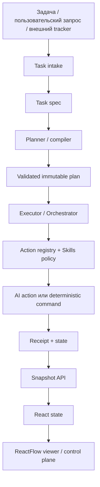
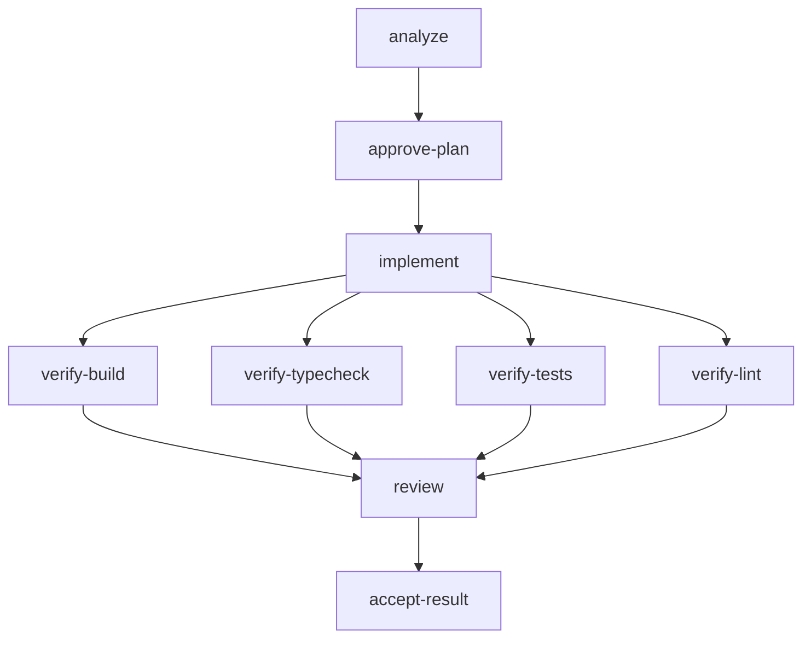
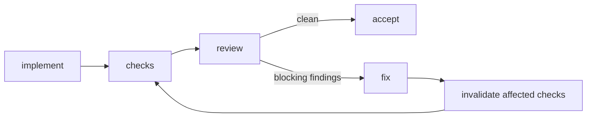
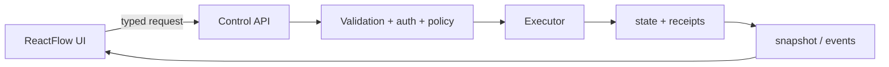

# Graph + ReactFlow: стандарт AI Workflow

> Этот документ задаёт универсальный стандарт проектирования, исполнения, наблюдения и развития AI Workflow на основе Graph Runtime и ReactFlow.
>
> Он не описывает одну конкретную задачу. Любая новая задача должна проходить через одни и те же принципы, gates, evidence и правила безопасности.

---

## Профили исполнения Flowcairn

Этот документ описывает общие свойства runtime. Flowcairn поддерживает два явно различимых профиля:

- **Управляемый:** отдельные решения о чтении, плане и финальной приемке, как в примерах ниже. Он сохраняется для совместимости существующих запусков.
- **Продуктовый:** после первоначальной настройки разрешенного чтения задача проходит анализ и планирование; человек уточняет и один раз согласовывает план. Затем runtime выполняет разрешенные этапы и ограниченный цикл исправлений. Финальное состояние означает **готово к личному ревью**, а не «человек уже принял результат».

В продуктовом профиле исправления используют записанную политику исходного согласования, а не выдуманное новое решение человека. Неизвестный результат, расширение прав или области и исчерпание лимитов останавливают работу. План остается неизменным; новая версия сохраняет происхождение и доказательства. Commit, PR, push и deploy не являются автоматическим продолжением задачи.

Пользовательский сценарий и текущие ограничения: [первая задача](FIRST-TASK.md), [архитектура](ARCHITECTURE.md), [границы](LIMITATIONS.md). Примеры CLI и `accept-result` ниже относятся к управляемому профилю; они не добавляют штатных согласований в продуктовый сценарий.

---

# 1. Зачем нужен Graph

**Graph — это исполняемая карта работы.**

Он превращает большую задачу из «AI что-то делает в репозитории» в последовательность проверяемых шагов с явными зависимостями, состояниями и доказательствами результата.

Базовые понятия:

- **node** — один атомарный и проверяемый этап работы;
- **edge / needs** — зависимость между этапами;
- **state** — текущее состояние run и каждого node;
- **receipt** — сохранённое доказательство конкретной попытки выполнения;
- **gate** — точка, где автоматическое продолжение запрещено без явного решения человека;
- **run** — конкретное исполнение конкретной версии плана;
- **plan** — неизменяемое описание исполняемого Graph для данного run.

Главная ценность Graph — не схема сама по себе. Graph должен гарантировать, что сложная работа не может незаметно перепрыгнуть анализ, согласование, реализацию, проверки, review и финальную приёмку.

## Нормативный принцип

Graph **MUST** отвечать за порядок, зависимости, разрешения, состояние, evidence и воспроизводимость исполнения.

Graph **MUST NOT** считать результат успешным только потому, что AI сообщил «готово».

Успех должен подтверждаться проверяемыми артефактами: exit code, checks, diff, review, receipts и human gates.

---

# 2. Что такое ReactFlow и чего он не делает

ReactFlow — это UI-библиотека для визуализации и взаимодействия с узлами и связями.

Она может:

- рисовать `nodes` и `edges`;
- показывать статусы, зависимости, ошибки и метаданные;
- поддерживать zoom, MiniMap, selection и layout;
- отображать custom nodes;
- показывать toolbar у выбранного node;
- размещать глобальные панели и собственные control buttons;
- сохранять пользовательское расположение элементов;
- вызывать frontend handlers по нажатию кнопок.

ReactFlow **не является workflow engine**.

Он сам по себе:

- не понимает смысл задачи;
- не выбирает Skills;
- не решает, какой node можно запускать;
- не запускает shell-команды;
- не подтверждает gates;
- не определяет успешность результата;
- не должен напрямую изменять исполняемый plan.

Граница ответственности:

```text
Task / plan / executor / state / receipts
                 ↓
           API snapshot
                 ↓
             React UI
                 ↓
            ReactFlow
```

**Executor является источником истины. ReactFlow является представлением этого состояния.**

---

# 3. Главный архитектурный принцип



Система должна быть разделена на два слоя:

1. **Control / execution plane** — решает, что разрешено выполнить, запускает действие и фиксирует результат.
2. **Presentation plane** — показывает состояние и даёт человеку безопасные элементы управления.

UI не должен обходить execution plane.

---

# 4. Кто за что отвечает

| Компонент               | Делает                                                                                                  | Не делает                                                         |
| ----------------------- | ------------------------------------------------------------------------------------------------------- | ----------------------------------------------------------------- |
| Graph / Plan            | Описывает nodes, dependencies, gates и обязательные свойства этапов                                     | Не пишет код сам                                                  |
| Task intake             | Преобразует входную задачу в нормализованный task spec                                                  | Не должен автоматически запускать запись в workspace              |
| Planner / compiler      | Строит или компилирует исполняемый план                                                                 | Не должен незаметно менять уже запущенный immutable plan          |
| Executor / Orchestrator | Выбирает готовый node, проверяет зависимости и permissions, запускает action, сохраняет state и receipt | Не отвечает за визуализацию                                       |
| Action registry         | Связывает разрешённое имя action с доверенной реализацией                                               | Не принимает произвольный shell из task JSON или браузера         |
| Skills policy           | Определяет обязательные инструкции для AI-action                                                        | Не является отдельным процессом выполнения                        |
| AI action               | Выполняет ограниченный этап анализа, реализации или review                                              | Не является источником истины по успешности                       |
| Deterministic checks    | Запускают build, typecheck, tests, lint и другие проверки                                               | Не заменяют смысловой review                                      |
| Snapshot API            | Отдаёт безопасное проверенное состояние viewer                                                          | Не должен раскрывать секреты и необработанные чувствительные логи |
| ReactFlow               | Визуализирует Graph и может инициировать разрешённые UI actions                                         | Не исполняет workflow самостоятельно                              |
| Human operator          | Принимает решения в критических gates                                                                   | Не должен вручную следить за каждым техническим микрошагом        |

---

# 5. Task intake: откуда появляется задача

Источник задачи может быть любым:

- issue tracker;
- текст пользователя;
- документ;
- API;
- ручной JSON;
- другая AI-сессия;
- автоматический adapter.

Но вход должен быть приведён к **task spec**.

Минимальный task spec должен содержать:

```json
{
  "taskId": "<task-id>",
  "goal": "Наблюдаемый результат задачи",
  "instruction": "Полное описание требований и ограничений",
  "checks": {
    "build": true,
    "typecheck": true,
    "tests": true,
    "lint": true
  }
}
```

При необходимости добавляются:

- acceptance criteria;
- allowed / forbidden paths;
- security constraints;
- product assumptions;
- external dependencies;
- required human decisions;
- environment constraints;
- rollback requirements.

## Правило intake

Создание task spec **не равно разрешению на исполнение**.

Нормальный lifecycle:

```text
input → task spec → plan → human gate → execution
```

Автоматический intake разрешён. Автоматическое изменение production-кода без явной политики разрешений — нет.

---

# 6. Как должен строиться Graph

Graph должен описывать не «что AI хочет попробовать», а **какие проверяемые результаты должны существовать до перехода дальше**.

Базовая форма delivery workflow:



Это **baseline**, а не обязательная форма для всех будущих задач.

Если проект поддерживает динамический planner, он может предложить дополнительные nodes или другую структуру. Но новый plan должен пройти validation и human approval до исполнения.

## Хороший node

Node должен:

- иметь один понятный outcome;
- быть достаточно малым для проверки;
- иметь явные dependencies;
- иметь определённый action type;
- иметь понятный success contract;
- указывать, может ли он писать в workspace;
- указывать, можно ли его безопасно повторить;
- производить receipt;
- не скрывать внутри себя огромный независимый workflow без причины.

## Плохой node

Примеры плохой гранулярности:

```text
"сделай всю задачу"
"почини всё"
"проверь проект"
"реализуй и сам реши, что считать готовым"
```

Такие этапы плохо наблюдаемы, плохо повторяемы и создают ложное ощущение контроля.

---

# 7. Зависимости и параллельность

Graph задаёт логическую возможность параллельной работы, но **не обязан автоматически запускать всё параллельно**.

Два node можно выполнять параллельно только если одновременно выполняются условия:

- отсутствует dependency между ними;
- они не изменяют одни и те же owning paths;
- они не используют конфликтующий shared resource;
- порядок выполнения не влияет на контракт;
- итог можно независимо проверить;
- executor умеет безопасно управлять конкурентной записью.

**Один топологический слой DAG не означает автоматически безопасную параллельность.**

Если есть сомнение — последовательное выполнение безопаснее.

---

# 8. Immutable plan и версионирование

После подтверждения план для конкретного run должен считаться неизменяемым.

Это нужно, чтобы всегда можно было доказать:

- что именно собирались выполнить;
- какой набор Skills применялся;
- какие dependencies существовали;
- какие actions были разрешены;
- к какой версии плана относится receipt.

Если во время работы открылась новая информация и требуется изменить Graph, стандартный путь:

```text
current run → stop / mark stale → draft new plan version → validate → approve → new run
```

Нельзя тихо переписывать активный plan и продолжать как будто ничего не произошло.

---

# 9. Как Graph связан со Skills

**Node и Skill — разные сущности.**

- Node отвечает на вопрос: **какой проверяемый результат нужен?**
- Skill отвечает на вопрос: **по каким инструкциям AI должен его получить?**

Skill не обязан быть отдельным node.

Пример политики:

| Action    | Тип обязательных Skills                                            |
| --------- | ------------------------------------------------------------------ |
| analyze   | project context / architecture / research policy                   |
| implement | project context / clean implementation / testing / delivery policy |
| review    | project context / review policy                                    |

Точные имена Skills могут отличаться между проектами. Источником истины должна быть доверенная policy в runtime, а не произвольное поле task JSON.

## Требования к Skill-policy

Executor **SHOULD**:

1. разрешать только зарегистрированные Skills;
2. проверять metadata;
3. фиксировать версии или content hashes;
4. сохранять manifest в run;
5. передавать AI точный текст обязательных инструкций;
6. повторно проверять неизменность пакета после action;
7. сохранять использованные Skills и hashes в receipt.

Если обязательная инструкция изменилась после создания run, run должен быть помечен как `stale` или требовать новую версию политики.

Self-report модели `skillsUsed` — это дополнительное evidence, но не доказательство качества. Качество подтверждают diff, checks, review и человек.

---

# 10. Роль Orchestrator / Executor

Executor должен выполнять только готовые nodes.

Node готов, если:

```text
status == pending
AND все needs == passed
AND требуемые permissions разрешены
AND run не stale
AND workspace находится в допустимом состоянии
```

Типичный цикл:

1. загрузить immutable plan;
2. проверить integrity;
3. найти готовый node;
4. проверить permissions;
5. получить action из доверенного registry;
6. установить node в `running` до внешнего запуска;
7. выполнить action с timeout и ограничением output;
8. проверить технический результат;
9. проверить semantic contract результата;
10. записать receipt;
11. выставить `passed`, `failed` или `uncertain`;
12. пересчитать доступность следующих nodes.

## Принцип deny-by-default

Неизвестное действие, неизвестный Skill, неподтверждённая запись или нарушенная целостность должны приводить к остановке, а не к «попробуем всё равно».

---

# 11. Permissions

Полезно разделять минимум два разрешения:

- **AI permission** — можно ли отправить разрешённый контекст модели;
- **write permission** — можно ли изменять workspace.

Дополнительно могут существовать:

- network permission;
- package-install permission;
- external-service permission;
- commit permission;
- push permission;
- deployment permission.

Разрешения должны быть явными и минимальными.

Факт наличия технического флага разрешения не заменяет организационную политику компании по работе с закрытым кодом и данными.

---

# 12. Human gates

Human gate нужен там, где цена неверного автоматического решения выше стоимости короткой проверки человеком.

Типовые gates:

- `approve-plan` — перед первой записью;
- подтверждение опасной миграции;
- подтверждение изменения публичного контракта;
- подтверждение внешнего side effect;
- `accept-result` — финальная приёмка результата.

Gate должен показывать:

- что именно подтверждается;
- plan / diff / evidence;
- открытые риски;
- точный scope следующего действия;
- последствия approve / reject.

Подтверждение должно быть audit-friendly. Для критических gates полезен challenge/token, чтобы случайный click не считался полноценным решением.

---

# 13. Что сохраняет receipt

Receipt должен позволять восстановить, что произошло в конкретной попытке.

Минимальный набор:

- run id;
- node id;
- attempt;
- action;
- started / finished;
- duration;
- exit code;
- timeout / output-limit flags;
- безопасная summary;
- hashes входных инструкций;
- Skills manifest;
- semantic verdict;
- checks;
- изменённые файлы или diff reference;
- failure / blocking reason;
- workspace fingerprint до/после, если это важно.

Receipt должен быть достаточно подробным для аудита, но не должен без необходимости хранить секреты, токены или полный чувствительный stdout.

---

# 14. Что происходит после завершения node

Нормальная цепочка:

```text
action завершился
→ executor проверил технический результат
→ проверил Skill / plan integrity
→ проверил semantic contract
→ создал safe summary
→ записал receipt
→ обновил state
→ пересчитал готовые nodes
→ snapshot API отдал новое состояние
→ UI получил snapshot / event
→ ReactFlow перерисовал Graph
```

ReactFlow не принимает решение, что node `passed`. Он только показывает решение execution plane.

---

# 15. Ошибки и неизвестное состояние

## `failed`

Используется, когда результат точно известен и не соответствует success contract.

Примеры:

- command вернул ошибку;
- tests упали;
- обязательный output отсутствует;
- review вернул blocking findings;
- обязательный Skill-route не выполнен.

Downstream nodes не должны запускаться, пока dependency не исправлена.

## `uncertain`

Используется, когда executor не может безопасно доказать итог.

Примеры:

- crash во время записи;
- процесс был убит после частичного изменения файлов;
- workspace неожиданно изменился;
- plan / Skill changed во время action;
- cleanup не подтверждён;
- неизвестно, был ли завершён внешний side effect.

`uncertain` опаснее обычного `failed`, потому что повтор может продублировать действие.

Стандарт:

```text
uncertain → inspect → recover → explicit acknowledgement → retry only if safe
```

---

# 16. Retry

Retry нельзя считать универсально безопасным.

Каждый action должен явно иметь свойство вроде:

```text
retrySafe: true | false
```

Примеры обычно безопасного retry:

- read-only analysis;
- deterministic lint;
- tests;
- typecheck;
- чистая сборка при контролируемом output.

Примеры потенциально опасного retry:

- запись кода после частично завершённого изменения;
- миграция данных;
- отправка сообщения;
- deployment;
- внешняя транзакция.

UI не должен показывать активную кнопку `Retry`, если backend не подтвердил, что retry разрешён.

---

# 17. Replanning

Replanning требуется, когда исходный plan больше не соответствует реальности.

Триггеры:

- найдено неверное предположение;
- изменился внешний контракт;
- review выявил архитектурную проблему;
- scope существенно расширился;
- появился новый обязательный risk / Skill;
- выбранный путь реализации оказался невозможен.

Рекомендуемый процесс:

```text
failed / new evidence
→ produce replan proposal
→ invalidate affected downstream nodes
→ human review
→ new immutable plan version
→ new or resumed controlled run
```

Нельзя позволять модели бесконечно переписывать собственный план без лимитов и human gate.

---

# 18. Review → Fix loop

Для зрелого workflow полезен контролируемый цикл:



Обязательные ограничения:

- ограничение числа циклов;
- отдельные receipts;
- фиксированный diff scope;
- повтор обязательных checks;
- запрет «исправить review и сразу принять себя» без независимой проверки.

---

# 19. Что показывает ReactFlow

Минимальный viewer должен показывать:

- nodes и edges;
- node status;
- dependencies;
- action type;
- read-only / write mode;
- обязательные Skills;
- attempt count;
- duration;
- safe receipt summary;
- failure / blocking reason;
- changed files после завершения;
- gates;
- общий run status.

Цвет — только дополнительный сигнал. Статус всегда должен быть доступен текстом.

## Рекомендуемые статусы UI

```text
pending
ready
running
waiting-for-human
passed
failed
uncertain
stale
```

Если runtime физически не хранит `ready`, viewer может вычислять его как derived state.

---

# 20. Planning: что должен видеть человек

Во время анализа пользователь должен понимать:

1. какой node сейчас выполняется;
2. что этот этап read-only;
3. какие Skills применены;
4. какой scope анализируется;
5. какие assumptions и risks найдены;
6. какой план предлагается;
7. почему система остановилась на gate.

Graph не обязан перестраиваться в реальном времени во время анализа.

Если AI предлагает новый executable Graph, сначала это должен быть **draft plan**, а не мгновенное изменение активного run.

---

# 21. Coding: что должен видеть человек

Во время write-action полезно показывать:

- `running`;
- write permission;
- action/session id;
- started time;
- elapsed time;
- текущую фазу, если executor публикует bounded progress;
- список уже зафиксированных artifacts;
- безопасные логи или последние события;
- кнопку перехода к details.

После завершения:

- changed files;
- diff reference;
- checks;
- duration;
- Skills / hashes;
- outcome;
- следующую разрешённую операцию.

Не нужно имитировать процент выполнения, если executor не может его честно измерить.

---

# 22. ReactFlow как read-only viewer — безопасный baseline

Самый простой режим:

```text
state + plan + receipts
→ server validates and sanitizes
→ GET /api/snapshot
→ React state
→ ReactFlow nodes / edges
```

Polling допустим как baseline.

Плюсы:

- просто;
- легко отлаживать;
- нет сложного realtime-state;
- UI остаётся read-only.

Минусы:

- задержка обновления;
- нет live progress;
- нет push events;
- оператору приходится использовать CLI для управления.

---

# 23. ReactFlow можно превратить в control plane UI

При необходимости ReactFlow можно расширить так, чтобы большую часть ежедневного управления run выполнять из UI.

Это **не меняет основной принцип**: кнопка в ReactFlow только инициирует запрос к backend. Все проверки выполняет executor.

Правильная архитектура:



Неправильная архитектура:

```text
React button → arbitrary shell command
```

Так делать нельзя.

---

# 24. Какие UI-кнопки полезно добавить

## На уровне всего run

В `Panel` или отдельной command bar:

- **Run ready node(s)** — продолжить run;
- **Run analysis** — если разрешён AI, но запрещена запись;
- **Enable write for this action** — только через явное подтверждение;
- **Refresh**;
- **Fit graph**;
- **Open latest receipt**;
- **Open diff**;
- **Open checks**;
- **History**;
- **Compare runs**;
- **Copy next CLI command** как fallback.

## На уровне node

Через custom node или `NodeToolbar`:

- **Details**;
- **Open receipt**;
- **Open artifacts**;
- **Retry** — только если `retrySafe`;
- **Recover** — только для допустимого состояния;
- **Approve / Reject** — только для gate nodes;
- **View dependencies**;
- **Re-run check** — для deterministic check;
- **Create replan proposal** — не менять plan напрямую.

Кнопки должны генерироваться из capability backend, а не из предположений frontend.

Например:

```json
{
  "nodeId": "verify-tests",
  "capabilities": {
    "retry": true,
    "approve": false,
    "recover": false,
    "openReceipt": true
  }
}
```

UI рендерит только разрешённые действия.

---

# 25. Custom Nodes

ReactFlow позволяет использовать обычные React-компоненты как nodes. Поэтому карточка node может стать компактной операторской панелью.

Рекомендуемый состав карточки:

```text
┌──────────────────────────────────┐
│ implement                 RUNNING │
│ AI · write                        │
│ 4 required skills                │
│ elapsed: 02:14                    │
│                                   │
│ latest: editing workspace         │
│                                   │
│ [Details] [Artifacts]             │
└──────────────────────────────────┘
```

Для failed node:

```text
┌──────────────────────────────────┐
│ verify-tests              FAILED  │
│ deterministic check               │
│ 3 tests failed                    │
│                                   │
│ [Details] [Logs] [Retry]          │
└──────────────────────────────────┘
```

Важное правило: карточка показывает состояние, но не придумывает его.

---

# 26. NodeToolbar

`NodeToolbar` полезен для действий, которые нужны только у выбранного node и не должны постоянно перегружать Graph.

Пример назначения:

```text
select node
→ toolbar appears
→ Details | Receipt | Retry | Approve
```

Это лучше, чем постоянно рисовать по 4–6 кнопок внутри каждого node.

Критические действия должны требовать дополнительного подтверждения.

---

# 27. Глобальная Panel

`Panel` можно использовать для command center поверх Graph.

Полезные элементы:

- task / run selector;
- общий статус;
- active node;
- search;
- filters;
- `Run`;
- `Pause after current node`, если backend это поддерживает;
- layout selector;
- toggle `show passed`;
- toggle `show receipts`;
- toggle `show skills`;
- legend;
- history;
- environment badge.

UI должен позволять за несколько секунд ответить на вопросы:

```text
Что сейчас происходит?
Почему это происходит?
Что уже доказано?
Что сломалось?
Что система ждёт от меня?
Что будет запущено следующим?
```

---

# 28. Controls и собственные ControlButton

Стандартные Controls можно расширять собственными кнопками.

Подходящие действия:

- focus active node;
- fit failed nodes;
- show only ready nodes;
- center on human gate;
- toggle compact mode;
- switch layout direction;
- open keyboard-shortcuts help.

Не следует помещать опасные execution actions рядом с обычным zoom без визуального разделения.

---

# 29. Сохранение UI layout

Пользователь может перемещать nodes для удобства. Это **UI state**, а не plan state.

Хранить можно:

- node positions;
- viewport;
- zoom;
- selected filters;
- collapsed groups;
- personal layout preset.

Хранилище:

- `localStorage` — простой персональный вариант;
- backend user preferences — если layout нужен между устройствами;
- saved view preset — если команда делится общим представлением.

Нельзя позволять изменению позиции node менять execution dependencies.

---

# 30. Редактирование Graph через ReactFlow

ReactFlow технически позволяет соединять, добавлять и удалять nodes. Это можно использовать для **draft planner UI**.

Но режимы должны быть строго разделены:

## View / Run mode

- active plan read-only;
- нельзя менять edges;
- нельзя удалить node;
- можно только выполнять разрешённые control actions.

## Draft plan mode

Можно:

- добавить node;
- удалить draft node;
- изменить dependencies;
- выбрать action type;
- задать resources / paths;
- добавить gate;
- изменить labels.

После редактирования:

```text
ReactFlow draft
→ backend validation
→ DAG check
→ action / Skill policy validation
→ resource conflict validation
→ human approval
→ new immutable plan version
```

Никогда:

```text
edit active edge → executor сразу поменял поведение
```

---

# 31. Realtime updates

Для зрелого viewer polling можно заменить или дополнить push-моделью.

Рекомендуемый вариант для локального control plane:

```text
executor emits bounded events
→ server publishes SSE
→ UI updates active node / logs / progress
→ final truth still comes from persisted state + receipt
```

SSE обычно достаточно для однонаправленного потока статусов от backend к UI.

WebSocket имеет смысл, если действительно нужен двусторонний realtime-канал.

Важно: realtime event — это уведомление, а не новый источник истины. После reconnect UI должен уметь полностью восстановиться из snapshot.

---

# 32. Bounded live logs

Полный stdout AI или команд часто слишком шумный и может содержать чувствительные данные.

Лучше публиковать структурированные события:

```json
{
  "runId": "<run-id>",
  "nodeId": "implement",
  "type": "progress",
  "phase": "editing",
  "message": "Updated 3 files",
  "timestamp": "..."
}
```

Полезные event types:

```text
node.started
node.progress
artifact.created
check.started
check.finished
node.blocked
node.failed
node.completed
gate.waiting
run.completed
```

Нужны ограничения размера, rate limit и sanitization.

---

# 33. Artifacts-first UI

Вместо огромных логов UI должен давать быстрый доступ к результатам:

- analysis plan;
- diff;
- changed files;
- test report;
- build report;
- review findings;
- screenshots;
- benchmark report;
- generated docs;
- final handoff.

Для каждого artifact полезно хранить:

```text
name
type
createdByNode
path/reference
hash
size
safe-to-render flag
```

---

# 34. Search и фильтры

На больших Graph обязательно нужны:

- поиск node по имени;
- фильтр `failed`;
- фильтр `waiting-for-human`;
- фильтр `running`;
- фильтр по Skill;
- фильтр по action type;
- hide passed;
- show downstream of selected;
- show critical path.

Это делает ReactFlow рабочим инструментом, а не просто красивой схемой.

---

# 35. Groups и subflows

Большие планы лучше группировать:

```text
Research
Planning
Implementation
Verification
Review
Delivery
```

Группа может показывать агрегированный статус:

```text
Implementation: 4 / 6 passed, 1 running, 1 pending
```

Пользователь должен иметь возможность свернуть завершённую группу и сосредоточиться на активной части Graph.

---

# 36. Layout

Для workflow обычно полезны автоматические layout strategies:

- left → right для pipeline;
- top → bottom для process flow;
- layered DAG layout для сложных dependencies.

Автоматический layout должен работать только с UI positions.

Execution edges остаются частью plan и не должны меняться из-за layout algorithm.

---

# 37. «Следующее действие»

Один из самых полезных UX-элементов — отдельная панель **Next action**.

Она может показывать:

```text
Сейчас: approve-plan ждёт вашего решения.

Перед подтверждением проверьте:
- 3 assumptions
- 2 risks
- proposed file scope

Дальше будет разрешена запись в workspace.

[Open plan] [Approve] [Reject]
```

Или:

```text
Run остановлен: verify-tests failed.
Retry разрешён.

[Open report] [Retry tests]
```

Это снижает необходимость помнить CLI и устройство runtime.

---

# 38. История и сравнение runs

Viewer должен уметь различать:

- текущий run;
- завершённые runs;
- stale runs;
- failed / abandoned runs.

Полезное сравнение:

```text
run A vs run B
- plan version
- changed nodes
- changed Skills
- changed files
- checks
- review verdict
- duration
```

История не должна засорять основной рабочий экран.

---

# 39. Безопасность control UI

Если ReactFlow получает управляющие кнопки, требования становятся строже.

Backend **MUST**:

- валидировать каждое действие;
- проверять текущий state заново;
- проверять capability для node;
- не доверять `nodeId`, action и flags из браузера;
- использовать allowlist actions;
- не принимать arbitrary shell;
- иметь idempotency для опасных запросов;
- вести audit log;
- защищать gate actions от случайного повторного submit;
- ограничивать payload;
- не отдавать секреты в snapshot.

Frontend — недоверенная граница.

Даже локальный UI не должен считаться security boundary.

---

# 40. API для control plane

Вместо «кнопка запускает CLI-строку» лучше дать viewer узкий typed API.

Пример:

```text
GET  /api/runs
GET  /api/runs/:runId/snapshot
GET  /api/runs/:runId/events
GET  /api/runs/:runId/nodes/:nodeId/receipt
POST /api/runs/:runId/run
POST /api/runs/:runId/nodes/:nodeId/retry
POST /api/runs/:runId/recover
POST /api/runs/:runId/gates/:gateId/decision
POST /api/runs/:runId/replan
```

Это пример интерфейса, а не обязательные URL.

Каждый endpoint должен вызывать те же domain-level проверки, что и CLI.

**CLI и UI должны быть двумя интерфейсами к одному runtime, а не двумя разными реализациями правил.**

---

# 41. Не дублировать бизнес-логику в frontend

Плохой вариант:

```text
if node.status === 'failed' then show retry and POST shell command
```

Правильный вариант:

```text
backend snapshot:
capabilities.retry = true

frontend:
if capabilities.retry → render Retry
```

Backend знает:

- retry policy;
- attempts limit;
- uncertain state;
- workspace lock;
- stale policy;
- permissions.

Frontend не должен повторять эти правила самостоятельно.

---

# 42. CLI остаётся обязательным fallback

Даже если почти всё управление перенесено в ReactFlow UI, CLI полезен как:

- recovery path;
- automation interface;
- debugging interface;
- CI integration;
- headless execution;
- способ проверить, что UI не содержит скрытую бизнес-логику.

UI должен упрощать работу, но не становиться единственным способом управлять runtime.

---

# 43. Универсальный lifecycle задачи

| Этап              | Человек                                 | Graph / AI                                      | ReactFlow                             |
| ----------------- | --------------------------------------- | ----------------------------------------------- | ------------------------------------- |
| Intake            | Даёт задачу и ограничения               | Формирует task spec                             | Может показать draft task             |
| Create plan       | Проверяет scope                         | Compiler/planner создаёт plan                   | Показывает Graph                      |
| Analyze           | Разрешает AI-контекст при необходимости | Read-only analysis                              | Показывает active node и findings     |
| Approve plan      | Принимает решение                       | Gate блокирует запись                           | Показывает Approve / Reject           |
| Implement         | Разрешает write                         | AI изменяет workspace                           | Показывает running и bounded progress |
| Verify            | Изучает failures при необходимости      | Build/typecheck/tests/lint                      | Показывает результаты checks          |
| Review            | Читает findings                         | Независимый review                              | Показывает verdict и evidence         |
| Fix loop          | Подтверждает существенный replan        | Fix → checks → review                           | Показывает цикл и attempts            |
| Accept            | Финально принимает результат            | Gate завершает run                              | Показывает completed                  |
| External delivery | Отдельное решение                       | Commit/push/deploy только по отдельной политике | Может давать отдельные actions        |

---

# 44. Что пользователь должен видеть в любой момент

Хороший UI позволяет мгновенно ответить на 7 вопросов:

1. **Какой run я смотрю?**
2. **Какой node активен?**
3. **Что уже успешно доказано?**
4. **Что ждёт выполнения?**
5. **Что сломалось и почему?**
6. **Нужно ли сейчас решение человека?**
7. **Что произойдёт после моего следующего действия?**

Если UI не отвечает на эти вопросы, визуализация недостаточно полезна.

---

# 45. Универсальные команды

Из `<repo-root>`:

```bash
# Создать run
node .ai/graphs/runtime/cli.mjs create \
  .ai/graphs/runtime/tasks/<task-id>.json \
  <run-id>

# Посмотреть состояние
node .ai/graphs/runtime/cli.mjs status <run-id>

# Разрешить только AI/read-only этапы
node .ai/graphs/runtime/cli.mjs run <run-id> --allow-ai

# Подтвердить plan gate
node .ai/graphs/runtime/cli.mjs decide \
  <run-id> approve-plan approve <challenge>

# Разрешить AI и запись
node .ai/graphs/runtime/cli.mjs run \
  <run-id> --allow-ai --allow-write

# Повторить только безопасный failed node
node .ai/graphs/runtime/cli.mjs retry \
  <run-id> <node-id>

# Восстановиться после crash / uncertain state
node .ai/graphs/runtime/cli.mjs recover <run-id>

# Финальная приёмка
node .ai/graphs/runtime/cli.mjs decide \
  <run-id> accept-result accept <challenge>
```

Команды являются интерфейсом к runtime. Если появляется ReactFlow control UI, он должен использовать ту же доменную логику.

---

# 46. Универсальные prompt-шаблоны

## Подготовить новую задачу

```text
Работай в <repo-root> на целевой рабочей ветке.
Используй локальные repository instructions и AI workflow rules.

Подготовь задачу <task-id> для Graph Runtime:
- проверь git root, branch, HEAD и незакоммиченные изменения;
- сформируй или проверь task spec;
- включи цель, полное описание, ограничения, acceptance criteria и необходимые checks;
- создай новый run с уникальным run-id.

Пока не изменяй product-код, не выполняй commit/push/merge и не запускай write-actions.
Покажи созданный plan, gates, назначенные Skills и точное следующее действие.
```

## Разрешить анализ

```text
Разрешаю read-only AI-анализ для run <run-id>.
Product-код не меняй.
После анализа остановись на approve-plan и покажи:
- план;
- assumptions;
- риски;
- предполагаемые изменяемые области;
- расхождения с исходной задачей.
```

## Разрешить реализацию

```text
План run <run-id> проверен.
Подтверди approve-plan точным challenge.
Затем продолжи execution с AI и write permission только в утверждённом scope.

Commit, push, merge, deployment и внешние side effects запрещены без отдельного разрешения.
Остановись при failed, uncertain или новом существенном риске.
```

## Финальная проверка

```text
Покажи результаты обязательных checks, AI-review, изменённые файлы, diff summary и открытые риски.
Ничего не принимай за меня.
Если evidence чистое — покажи точное действие для accept-result.
Если нет — предложи fix/replan path с указанием, какие nodes и checks будут invalidated.
```

---

# 47. Приоритет развития системы

Рекомендуемый порядок развития:

1. **Единая модель Graph.** Один формат должен быть источником истины для planner, executor и viewer.
2. **Typed task intake.** Текст задачи превращается в draft spec автоматически.
3. **Dynamic planner.** AI предлагает task-specific Graph, но validator + человек его утверждают.
4. **Immutable versioning.** Любое replanning создаёт новую проверяемую версию.
5. **Capabilities API.** Backend явно сообщает UI допустимые действия.
6. **ReactFlow control plane.** Details, Retry, gates и Run становятся доступны из UI.
7. **SSE events.** UI получает live status без агрессивного polling.
8. **Artifacts UI.** Diff, checks, reports и review открываются прямо из node.
9. **Fix/review loop.** Контролируемый цикл с лимитами и invalidation.
10. **Draft Graph editor.** Визуальное редактирование только до validation/approval.
11. **Run comparison.** История и сравнение evidence между попытками.
12. **External adapters.** Issue tracker, CI и delivery интегрируются последними, когда внутренний runtime уже надёжен.

---

# 48. Чего не стоит делать

Не превращать ReactFlow в workflow engine.

Не запускать shell напрямую из браузера.

Не считать перемещение node изменением plan.

Не позволять UI самостоятельно решать, что retry безопасен.

Не разрешать AI менять active plan без versioning и gate.

Не смешивать human approval с обычной кнопкой «continue» без объяснения последствий.

Не показывать фиктивный progress.

Не хранить чувствительные сырые логи только ради красивого UI.

Не считать self-report модели доказательством успешности.

Не делать commit/push/deploy неявным побочным эффектом завершения Graph.

---

# 49. Definition of Done для Graph Workflow

Workflow можно считать качественно завершённым, только если:

- [ ] задача нормализована в task spec;
- [ ] plan прошёл validation;
- [ ] обязательные human gates были подтверждены явно;
- [ ] все необходимые nodes имеют terminal state;
- [ ] обязательные checks прошли;
- [ ] review не содержит blocking findings;
- [ ] receipts доступны;
- [ ] plan / Skills integrity подтверждена;
- [ ] нет `uncertain` или `stale` состояния;
- [ ] diff соответствует утверждённому scope;
- [ ] финальная приёмка выполнена человеком;
- [ ] commit / push / deploy выполнены только если были отдельно разрешены.

---

# 50. Короткая шпаргалка

```text
Получил задачу
→ сформировал task spec
→ создал validated plan
→ увидел Graph в ReactFlow
→ запустил read-only analysis
→ изучил plan + risks
→ подтвердил approve-plan
→ разрешил write
→ implement
→ build / typecheck / tests / lint
→ independent review
→ fix/replan при необходимости
→ изучил diff + receipts
→ accept-result
→ отдельно commit / push / delivery
```

При failure:

```text
не нажимать Retry автоматически
→ понять тип failure
→ проверить retrySafe
→ проверить workspace
→ retry / recover / replan
```

---

# 51. Если запомнить только одно

**Graph — это система управления исполнением и доказательствами. ReactFlow — это интерфейс над этой системой.**

ReactFlow можно сделать настолько удобным, что запуск, approvals, retry, recovery, просмотр diff, checks, history и artifacts будут доступны кнопками прямо на Graph. Но каждая кнопка должна обращаться к доверенному backend API, а окончательное решение о допустимости действия всегда остаётся за runtime.

Идеальная система выглядит так:

```text
AI предлагает работу
Graph ограничивает и проверяет работу
Executor исполняет работу
Receipts доказывают работу
ReactFlow объясняет работу человеку
Human gates оставляют критические решения человеку
```

---

# 52. Официальные материалы React Flow

Для развития viewer/control plane полезны официальные возможности React Flow:

- API reference: https://reactflow.dev/api-reference
- Custom Nodes: https://reactflow.dev/learn/customization/custom-nodes
- NodeToolbar: https://reactflow.dev/api-reference/components/node-toolbar
- Controls: https://reactflow.dev/api-reference/components/controls
- ControlButton: https://reactflow.dev/api-reference/components/control-button
- Panel: https://reactflow.dev/api-reference/components/panel
- Save and Restore: https://reactflow.dev/examples/interaction/save-and-restore

Эти возможности позволяют строить поверх Graph не только read-only viewer, но и безопасный операторский интерфейс — при условии, что execution logic остаётся на backend.
